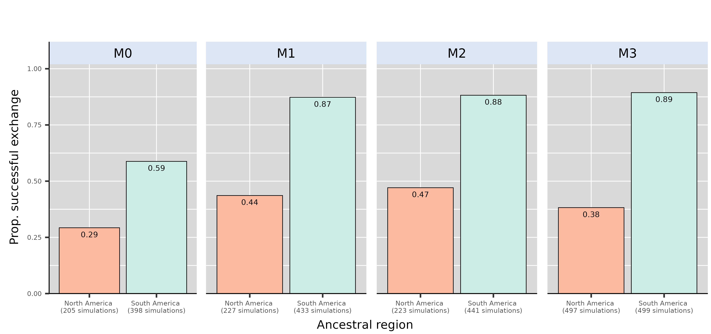

\noindent
Affiliations:  

\noindent
¹ Institut des Sciences de l’Evolution de Montpellier, Université de Montpellier, CNRS, IRD, Place Eugène Bataillon, 34095 Montpellier cedex 5, France.

\noindent
² Centro de Investigación Mariña, Departamento de Ecoloxía e Bioloxía Animal, Universidade de Vigo, Campus Lagoas-Marcosende, 36310 Vigo, Spain

# Potential journals

## Primary aims

Biology Letters or Current Biology

## Others that could fit

Proceedings B? Global ecology & Biogeography? Journal of Biogeography?

# Abstract

The Great American Biotic Interchange (GABI) refers to the admixture of North and South American faunas promoted by the Mio-Pliocene closure of the isthmus of Panama. Among mammals, this faunal exchange was asymmetric because it witnessed a greater ability of North American lineages to establish southwards, meanwhile many South Americans went extinct. Here, coupling a mechanistic eco-evolutionary simulator with high-resolution palaeoclimatic reconstructions for the last 5 million years, we explore the extent to which palaeoclimate may have shaped such a biogeographic asymmetry. When climatic variables are the only constraints to virtual species' ecology, our results indicate that successful interchanges are more frequently achieved when simulations start from South America than from North America, contrasting with empirical observations. In addition, our models fail at explaining the higher representation of temperate-adapted mammals in the fossil record of successfully exchanged mammals, particularly of North American origin, but suggest that successful colonisers from North America occupy larger areas in South America than the other way around. This study offers valuable insights into the processes behind one of the most puzzling macroecological enigmas, suggesting that palaeoclimatic history is not sufficient to explain the imbalanced success of North American migrants in South America following the GABI.


# Keywords
Eco-evolutionary simulations; Mammals; Macroecology; Palaeoclimate

\newpage

# Introduction

The Great American Biotic Interchange (GABI) refers to the large-scale faunal exchange -- mostly affecting land mammals -- that occurred between the Americas, favoured by the establishment of the isthmus of Panama [@marshall1982]. Though the exact timing of the closure of the isthmus is still debated [@montes2015; @jaramillo2018; @odea2016], palaeontological evidence and molecular phylogenies both agree with a late Miocene onset of land mammal exchange between the Americas, with most effective crossings occurring from *c.* 3.5 Million years ago (Ma) onwards [@verzi2008; @woodburne2010; @bacon2015; @bacon2016]. Despite its textbook nature, a puzzling feature of the GABI is that it impacted both continent's mammalian faunas very differently. In fact, evidence from the fossil record indicates that the early phases of the GABI were marked by reciprocal exchanges between the Americas [@webb1976; @marshall1982]. However, during the Quaternary, the ability of migrant lineages to maintain in the foreign area became greater in South America, and many native South American mammal lineages concomitantly declined, some of which even going totally extinct [@webb1991; @cione2015; @carrillo2020; @croft2020; @boscaini2025]. Hence, it turns out that this intercontinental faunal exchange has been strikingly asymmetric.

Although this macroecological imbalance is unquestionable, so far, no clear consensus regarding the forces underlying this asymmetry has been established. On one hand, biotic interactions involving migrant and native species have often been proposed to this aim. These would include competition [@webb1976; @simpson1980; @domingo2020] or predation of predator-naive preys [@webb1976; @marshall1990; @faurby2016; @fernández-monescillo2025]. However, their contribution to the asymmetry of the GABI has been increasingly called into question [*e*.*g*., @vrba1992; @prevosti2013; @tarquini2022; @marsà2025]. On the other hand, several studies proposed or found support for an implication of abiotic factors -- *i*.*e*., related to species' physical environment, such as climate -- in the asymmetry of this widely-known exchange [*e*.*g*., @marshall1990; @vrba1992; @webb1991; @bacon2016; @freitas-oliveira2024]. However, so far, most of these works have only relied on statistical analyses of the fossil record, and there is a lack of studies tackling the issue from a mechanistic perspective.

Recent improvements in process-explicit modelling have marked a turning point in the study of biodiversity [@pilowsky2022]. By combining a landscape made up with palaeoenvironmental variables and a set of eco-evolutionary rules according to which virtual species are simulated, mechanistic eco-evolutionary models offer the unique opportunity to casually explore the way biodiversity patterns arise and are maintained through evolutionary times [@hagen2023]. Recently, this family of models has provided unprecedented insights into the underlying forces behind widely-recognised biodiversity patterns, such as the latitudinal biodiversity gradient [@hagen2021], the diversity desequilibrium between tropical rainforests across the globe [@hagen2021b], the build-up of the unique biodiversity along the Wallace line [@skeels2023b] and many others [*e*.*g*., @boschman2023; @skeels2023; @liu2024]. 

Here, we explore the implication of palaeoclimate change in the asymmetry of the GABI using a mechanistic biodiversity simulator coupled with palaeoclimate reconstructions across the last 5 million years. Our simulations tracked the diversification of a clade either originating in North or South America. The ability of a virtual species to maintain at a given place was only mediated by climatic factors. We hypothesise that (i) simulations starting from a North American ancestor would be more successful at reaching the other continent than the other way round, (ii) successful simulations starting from a North American ancestor would result in a more diverse and spatially spread radiation in the foreign continent and (iii) temperate-adapted species from North America would be the more successful, according to the historical predictions of Webb, Marshall and Simpson.

# Materials and methods

Here, we term "North America" North + Central America. The delimitation between both continents was arbitrarily set in the middle of Panama (coordinates).

## Palaeoclimate data

**figure 1: plot spatial average of palaeoclimate data used here, indicating marked climatic events across the last 5Myr. Relate to Vrba's cooling?**

We used the spatio-temporal terrestrial palaeoclimate series from the PALEO-PGEM atmosphere-ocean general circulation model [@holden2019], covering the last 5 Myrs with a 1 \times 1 ° spatial resolution [@barreto2023]. For the scope of this work, we used two bioclimatic variables: mean annual temperature (MAT, BIO1) and mean annual precipitation (MAP, BIO12). To avoid reaching an overkillingly-high number of simulation steps, we reduced the temporal resolution of the climate simulations from a 1000 years-time step to a 10,000 years time-step.

In order to discriminate simulation on the basis of the biome the initial species starts in, we reclassified monthly palaeoclimate layers for our starting time (at $t=5$ Myrs) according to Köppen-Geiger broad climate types [@galván2023]. This classification divides the world into five broad climatic regions: Polar, Cold, Temperate, Arid and Tropical.

## Simulation model and modelling schemes

We performed our spatially-explicit simulations of biodiversity using the General Engine for Eco-Evolutionary SImulationS, gen3sis, v1.5.11 [@hagen2021]. Simulations, moving forward-in-time with a 10ky time step, tracked the radiation of a clade arising from a single ancestral population, either originating in North or in South America, throughout the last 5 Myr. In gen3sis, virtual species are made up with a set of individual populations evolving independently, following a set of four rules: dispersal, speciation, environmental filtering and trait evolution. All simulation scenarios that we implemented only differed on the last rule (trait evolution), the first three being common to all models (or at least partly).

Within the gridded landscape, a population inhabiting a cell could disperse to the surrounding cells with an intensity sampled in a Weibull distribution (shape and scale parameters available in SI). If, by chance, populations making up a species happened to be disconnected, they would accumulate divergence across the time steps as long as they get disconnected at a rate ruled by a divergence factor, here set to $0.05$. This value, around an order of magnitude lower than those usually encoutered in gen3sis case studies [*e*.*g*., @hagen2021; @boschman2023; @skeels2023b] was chosen in due to our high number of time steps ($500$). Once passed a divergence threshold (varying across replicates, see SI), speciation occurrs.

As our goal was to evaluate the extent to which palaeoclimate change may have shaped the unequal success of North American taxa establishing southwards compared to South American taxa establishing northwards, local climate was set as the only constraint for a population to maintain in a given cell. Each species was therefore assigned a two-dimensional climatic niche, one axis corresponding to temperature suitability and the other to precipitation suitability. The abundance of a species along an environmental gradient was ruled by two parameters -- that we also call traits --, an optimum and a breadth. A population could maintain in a given cell only if the difference between its optima and local climate (both temperature and precipitation) was below its breadth (or tolerance) parameters.

Across our simulation scenarios, we modulated the ability of species to cope with climate change, and thus, the generalist vs. specialist nature of the simulated species. In the full-adaptationist model (M1, generalist), climatic optima were able to evolve in the direction of local climate change. It is important to notice that niche parameters were population (and not species) specific. In the zero-adaptationist model (M0, specialist), niche optima couldn't evolve and were therefore held constant (to the initial value) across all simulations.

The range of the ancestor was randomly selected within the desired ancestral area (*i*.*e*., North or South America). To avoid oversampling high latitudes, we merged the ancestral landscape with the centroids of an equal-area grid (\~100km spacing) generated using the R package *h3jsr* [@obrien2023]. We then sampled a centroid at random and retrieved the corresponding cell in our landscape. To reduce the probability of initial crash, the temperature and/or precipitation optima parameter of the ancestor were set to those of the local environment.

Importantly, since the palaeoclimate reconstructions that we used ignored tectonic plate motion − a reasonable assumption for a 5-Myr time frame − continental position in our landscapes was held constant across simulations. Therefore, in this framework, changes in connectivity between North and South America could only arise from the environment.

Sobol' sequences for parameter space exploration, as done by skeels & co.

Divergence threshold vs. divergence factor.

A total of 500 replicates was made under each scenario, both with North and South America as an ancestral area.

## Postprocessing and quantifications

Once a

# Results

## Climate makes it easier to reach North America from South America than the other way round

Unexpectedly, our simulation-based framework suggests that the proportion of simulations successfully reaching the other continent is always higher when starting from South America than from North America (Fig X). This imbalance, strikingly going against our expectations, is maintained whether we allowed species climatic niche to evolve following climatic change (44% vs. 87%, model M1) or not (29% vs 59%, model M0, Figure 1). That being said, it has to be noticed that there the proportion of simulations resulting in no living representative (=crash) was on average twice higher for simulations starting in North America.

```{r, echo=FALSE}
#| label: fig1
#| fig-cap: Proportion of successful exchange to the other continent, either starting from North (red) or South (blue) America.

```

**Biome here?**

## Success on the foreign continent

## Geographic features of the simulated interchange

\newpage

# Discussion

Smoothing asymmetry =\> echo to birds [@weir2009], flying behaviour relaxing constraints applied to land mammals ?

Species pool proved relevant in the case of the interchange along the Wallacea [@skeels2023]. But here, we expect to find more species in South America, encompassing one of earth's major and long-standing biodiversity hotspot -- Amazonia [@antonelli2018] -- than in North America, though see Vrba.

## Climate

One of the predictions of Vrba's ressource-use hypotheses formulated in the framework of the habitat theory @vrba1992 applied to the GABI is that tropical specialists, in the aftermath of the global cooling occurring in the Plio-Pleistocene boundary, would have naturally been attracted towards the equator, in turn actively promoting some North American mammal's establishment in South America. On the other hand, fewer mammals -- only biome generalists or open-habitat specialists -- from South America are expected to roam the other way round. Our virtual experiments partially corroborate with these predictions, in the sense that tropical-adapted taxa of North American origin have a higher prevalence of crossing the isthmus than species belonging to other biomes (Figure X \[biomes\], model M0).

Success in South America for temperate-adapted species, posited as the most successful, not recovered, with tropical meeting the gighest success

## On the effect of geography

One consistent pattern, however, is the fact that the prevalence of an intercontinental interchange gets higher as the ancestral species' coordinates get closer to the isthmus, which mirrors the results of Motta & Quental [@motta2025]

Is it just about **reaching** or more about **reaching & surviving**?

Temporality (red queen vs. court jester, Benton 2001) => favouring biotic ?

Fortuitous experiment ?

## Limitations & perspectives

Maybe one of the most obvious caveats of our study stems from the assumption of fixed palaeogeography, particularly near the isthmus, whereas we know that this region changed across our study.

# Thrash

Throughout its evolutionary history, the biosphere has been repeatedly marked by the occurrence of geodispersal events, that is, exchanges of large species pools across landmasses [*e*.*g*., @couvreur2011, @upchurch2024].

Competition involving clades of similar ecology appeared as a likely first-order explanation to the recent demise of South American endemic mammal clades such as native ungulates [@croft2020] or sparassodonts (metatherian predators, [@pino2022; @tarquini2022]) that followed the establishment of northern lineages [@simpson1980]. This hypothesis mostly relied on striking morphological convergences between the clades assumed to have competed (*e*.*g*., sabertooth among predators, high-crowned and ever-growing cheek teeth among herbivores). However, several analyses of the fossil record provided no evidence for competition between native South American mammals and their northern counterparts [@prevosti2013; @tarquini2022]. That being said, using phylogenetic regressions, Faurby et al. [@faurby2016] found support for another biotic interaction as a likely driver behind GABI's asymmetry: predation. They indeed characterised a higher prevalence of traits increasing prey susceptibility among the endemic south american mammals. + larger niches of competitors [@domingo2020]

These would include Pleistocene climate fluctuations and the consequent alternating phases of emergence of open landscapes across Central America, in turn favouring the dispersal of large temperate-adapted mammals to the detriment of tropical-adapted ones

Other studies proposed the implication of abiotic factors. Some put the emphasis on Pleistocene climate fluctuations and the consequent alternating phases of emergence of landscape opening across Central America, in turn favouring the dispersal of large temperate-adapted mammals to the detriment of tropical-adapted ones [@marshall1990; @webb1991; @bacon2016]. Others drew direct relationships between the higher extinction rates of native South American mammal genera and temperature change [@freitas-oliveira2024].

several studies proposed that palaeoclimate change shaped unequal dispersal abilities between northern and southern taxa [@marshall1990; @webb1991; @bacon2016; @freitas-oliveira2024], although the hypothesis according to which the asymmetry of the GABI would stem from dispersal rates is still largely debated [*e*.*g*., @carrillo2020].


\newpage

# References

::: {#refs}
:::
