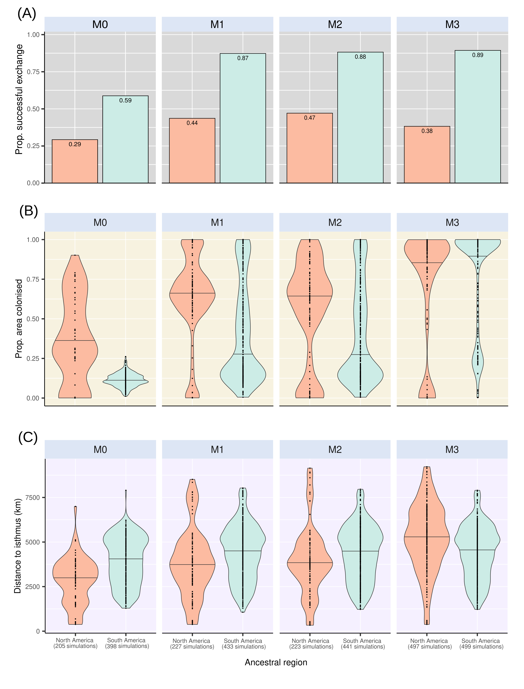
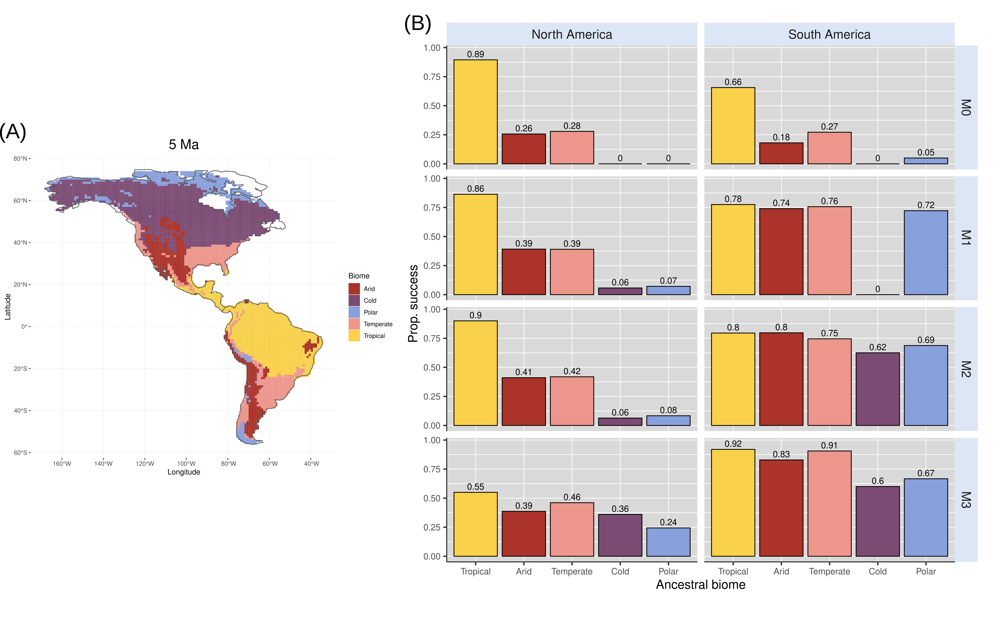

\noindent Affiliations:

\noindent ¹ Institut des Sciences de l’Evolution de Montpellier, Université de Montpellier, CNRS, IRD, Place Eugène Bataillon, 34095 Montpellier cedex 5, France.

\noindent ² Centro de Investigación Mariña, Departamento de Ecoloxía e Bioloxía Animal, Universidade de Vigo, Campus Lagoas-Marcosende, 36310 Vigo, Spain

# Abstract

The Great American Biotic Interchange (GABI) refers to the admixture of North and South American faunas promoted by the closure of the isthmus of Panama. Among land mammals, this faunal exchange was asymmetric because it witnessed a greater ability of North American lineages to establish southwards, meanwhile many South Americans went extinct. Here, coupling a mechanistic eco-evolutionary simulator with palaeoclimatic reconstructions for the last 5 million years, we explore the extent to which palaeoclimate, alone, may have shaped such a biogeographic asymmetry. When climatic variables are the only constraints to virtual species' dispersal, our results indicate that (1) successful interchanges are more frequently achieved when simulations start from South America than from North America, contrasting with empirical observations. In addition, (2) our models fail at explaining the higher representation of temperate-adapted mammals in the fossil record of successfully exchanged mammals, particularly of North American origin, but (3) suggest that successful colonisers from North America occupy larger areas in South America than the other way around. Hence, our findings stress that spatio-temporal palaeoclimate dynamics are not sufficient to explain the imbalanced success of North American migrants in South America following the GABI, suggesting the implication of additional biogeographic and ecological filters. This study offers valuable insights into the processes behind one of the most puzzling macroecological enigmas in the history of life on Earth.

# Keywords

Eco-evolutionary simulations; Mammals; Macroecology; Palaeoclimate \newpage

# Introduction

The Great American Biotic Interchange (GABI) refers to the large-scale faunal exchange -- mostly affecting land mammals -- that occurred between the Americas, favoured by the establishment of the isthmus of Panama [@marshall1982]. Though the exact timing of the closure of the isthmus is still debated [@montes2015; @jaramillo2018; @odea2016], palaeontological evidence and molecular phylogenies both agree with a late Miocene onset of land mammal exchange between the Americas, with most effective crossings occurring from *c.* 3.5 Million years ago (Ma) onwards [@verzi2008; @woodburne2010; @bacon2015; @bacon2016]. Despite its textbook nature, a puzzling feature of the GABI is that it impacted both continent's mammalian faunas very differently. In fact, evidence from the fossil record indicates that the early phases of the GABI were marked by reciprocal exchanges between the Americas [@webb1976; @marshall1982]. However, during the Quaternary, the ability of migrant lineages to maintain in the foreign area became greater in South America, and many native South American mammal lineages concomitantly declined, some of which even going totally extinct [@webb1991; @cione2015; @carrillo2020; @croft2020; @boscaini2025]. Hence, it turns out that this intercontinental faunal exchange has been strikingly asymmetric.

Although this macroecological imbalance is unquestionable, so far, no clear consensus regarding the forces underlying this asymmetry has been established. On one hand, biotic interactions involving migrant and native species have often been proposed to this aim. These would include competition [@webb1976; @simpson1980; @domingo2020] or predation of predator-naive preys [@webb1976; @marshall1990; @faurby2016; @fernández-monescillo2025]. However, their contribution to the asymmetry of the GABI has been increasingly called into question [*e*.*g*., @vrba1992; @prevosti2013; @tarquini2022; @marsà2025]. On the other hand, several studies proposed or found support for an implication of abiotic factors -- *i*.*e*., related to species' physical environment, such as climate -- in the asymmetry of this widely-known exchange [*e*.*g*., @marshall1990; @vrba1992; @webb1991; @bacon2016; @freitas-oliveira2024]. However, so far, most of these works have only relied on statistical analyses of the fossil record, and there is a lack of studies tackling the issue from a mechanistic perspective.

Recent improvements in process-explicit modelling have marked a turning point in the study of biodiversity [@pilowsky2022]. By combining a landscape made up with palaeoenvironmental variables and a set of eco-evolutionary rules according to which virtual species are simulated, mechanistic eco-evolutionary models offer the unique opportunity to casually explore the way biodiversity patterns arise and are maintained through evolutionary times [@hagen2023]. Recently, this family of models has provided unprecedented insights into the underlying forces behind widely-recognised biodiversity patterns, such as the latitudinal biodiversity gradient [@hagen2021], the diversity desequilibrium between tropical rainforests across the globe [@hagen2021b], the build-up of the unique biodiversity along the Wallace line [@skeels2023b] and many others [*e*.*g*., @boschman2023; @skeels2023; @liu2024].

Here, we explore the implication of palaeoclimate change in the asymmetry of the GABI using a mechanistic biodiversity simulator coupled with palaeoclimate reconstructions across the last 5 million years. Our simulations tracked the diversification of a clade either originating in North or South America. The ability of a virtual species to maintain at a given place was only mediated by climatic factors. We hypothesise that (i) simulations starting from a North American ancestor would be more successful at reaching the other continent than the other way round, (ii) successful simulations starting from a North American ancestor would result in a more diverse and spatially spread radiation in the foreign continent and (iii) temperate-adapted species from North America would be the more successful, according to the historical predictions of Webb, Marshall and Simpson.

\newpage

# Materials and methods

Beforehand, it has to be noticed that, across the entire study, "North America" actually refers to the current North and Central American continents. The delimitation between North and South America was represented as a straight line connecting two points located along the eastern and western coasts of present Panama ($-82.882°$lon, $7.138°$lat and $-81.369°$lon and $9.008°$lat) (@fig-1).

## Palaeoclimate data

```{r, echo=FALSE}
#| label: fig-1
#| fig-cap: Average palaeoclimate histories within our studied landmasses. North America is displayed in coral red and South America in cyan. Spatially-averaged climate variables (Annual Temperature and Precipitation) are taken from the PALEO-PGEM palaeoclimate emulator @holden2019. This emulator being spatialised at a 1 x 1° resolution, numbers inside the continents represent the quantity of overlaying pixels from the climate grid within each continent. On climate plots, the time of the likely onset of the GABI [@bacon2016] is indicated by the light purple vertical bands. Geological timescale was depicted using the deeptime R package [@gearty2023]. The empirically-derived asymmetry of the transcontinental land mammal exchange is represented by the thickness of the two arrows, the thicker the arrow, the more intense the exchange.

knitr::include_graphics("../Figures/MS/Main/Figure1/Figure1.png")
```

We used the spatio-temporal terrestrial palaeoclimate series from the PALEO-PGEM atmosphere-ocean general circulation model [@holden2019], covering the last 5 Myrs with a 1 $\times$ 1 ° spatial resolution [@barreto2023]. For the scope of this work, we used two bioclimatic variables: mean annual temperature (MAT, BIO1) and mean annual precipitation (MAP, BIO12). To avoid reaching an overkillingly-high number of simulation steps, we reduced the temporal resolution of the climate simulations from a 1000-years to a 10,000-years time step.

Additionally, in order to discriminate simulations on the basis of the biome the initial species starts in, we reclassified monthly palaeoclimate layers for our starting time ($t=5$ Myrs) according to Köppen-Geiger broad climate types [@beck2018; @galván2023]. This classification divides the world into five broad climatic regions: Polar, Cold, Temperate, Arid and Tropical, following the criteria proposed by Köppen [@köppen1900].

## Simulation model and modelling schemes

We performed our spatially-explicit simulations of biodiversity using the General Engine for Eco-Evolutionary SImulationS, gen3sis, v1.5.11 [@hagen2021]. Simulations, moving forward-in-time with a 10ky time step, tracked the radiation of a clade arising from a single ancestral population, either originating in North or in South America, throughout the last 5 Myr. In gen3sis, virtual species are made up with a set of individual populations evolving independently, following a set of four rules: dispersal, speciation, environmental filtering and trait evolution. All simulation scenarios that we implemented only differed on the last rule (trait evolution), the first three being common to all models (or at least partly).

We elaborated a gridded landscape made up with the two time-series of the aforementioned palaeoclimatic layers. Within this landscape, virtual species, made up with populations, inhabited a set of connected cells. At each time step, populations could disperse to the surrounding cells with an intensity sampled in a Weibull distribution (of shape and scale respectively termed $\phi$ and $\psi$). If, by chance, two populations happened to be disconnected, they would accumulate divergence as long as they get disconnected, at a rate ruled by a divergence factor, here set to $0.05$. Once passed a divergence threshold ($S$), speciation would occur. Thus, the only mode of speciation allowed by gen3sis is allopatry.

As our goal was to evaluate the extent to which palaeoclimate change may have shaped the unequal success of North American taxa establishing southwards compared to South American taxa establishing northwards, local climate was set as the only constraint for a population to maintain in a given cell. Each species was therefore assigned a two-dimensional climatic niche, one axis corresponding to temperature suitability and the other to precipitation suitability. The abundance of a species along an environmental gradient was ruled by two parameters -- that we also call traits -- a population- and species-specific optimum (resp. $P_{k,l}$ and $T_{k,l}$ for the precipitation and temperature optima of the population $k$ of the species $l$) and a breadth (or tolerance) (resp. $\omega_P$ and $\omega_T$; within a simulation, breadths were shared across populations and species). A population could maintain in a given cell only if the difference between its optima and local climate (both temperature and precipitation) was below its breadths. Therefore, given a site $i$ with local precipitation and temperature at time $t$ being $P_i(t)$ and $T_i(t)$, this translates in

$$
\begin{cases}
\lvert P_i(t) - P_{k,l} \rvert < \omega_P \\
\lvert T_i(t) - T_{k,l} \rvert < \omega_T
\end{cases}
$$

Each simulation started with a single ancestral species. The range of this ancestral species was randomly selected within the desired ancestral area (*i*.*e*., North or South America). To avoid oversampling high latitudes, we merged the ancestral landscape with the centroids of an equal-area grid (\~100km spacing) generated using the R package *h3jsr* [@obrien2023]. We then sampled a centroid at random and retrieved the corresponding cell in our landscape. To reduce the probability of initial crash, the temperature and/or precipitation optima parameter of the ancestor were set to those of the local environment.

A total of 500 replicates was made under each modelling scheme (detailed in the next paragraph), both with North and South America as ancestral area. Across replicates, we varied 6 key parameters: (1) the divergence threshold above which speciation occurred ($S$, range = $[1, 3]$), (2) the rate of environmental niche evolution -- only in models where we allowed climatic niche to evolve ($\sigma_e$, $[0.005, 0.15]$), (3) the shape ($\phi$, $[0.5, 3]$) and (4) scale ($\psi$, $[0.1, 1]$) of the Weibull distribution acting as a dispersal kernel, (5) the strength of environmental filtering (*i*.*e*., niche breadth) for temperature ($\omega_T$, $[0.01, 0.1]$) and (6) precipitation ($\omega_P$, $[0.05, 0.3]$). As done by many authors, we ensured an even sampling of the resulting multidimensional parameter space via a quasirandom sampling technique relying on Sobol' sequences [@hagen2021b; @skeels2023b]. Parameter ranges were determined on the basis of a literature review, allowing to assess their biological relevance, and were further adjusted in order to limit the prevalence of crashing simulations. In addition to these varying parameters, we specified the value of several fixed parameters (Tab. S1)

We implemented various simulation scenarios where we modulated the ability of species to cope with climate change, and thus, the generalist vs. specialist nature of the simulated species. In the full-adaptationist model (*M1*, generalist), climatic optima ($P_{k,l}$ and $T_{k,l}$) were able to evolve in the direction of local climate change. To isolate the effect of a single environmental covariate on the resulting simulated biodiversity pattern, alternative versions of this model consisted of either removing the temperature (*M2*) or the precipitation (*M3*) constraint on species ecology. Besides, we also implemented a zero-adaptationist model (*M0*, specialist), where niche optima could not evolve and were therefore held constant (to their initial value) across all simulations.

Last, it is important to notice that, since the palaeoclimate reconstructions that we used ignored tectonic plate motion -- a reasonable assumption for a 5-Myr time frame -- continental position in our landscapes was held constant across simulations. Therefore, in that framework, changes in connectivity between North and South America could only arise from the environment.

## Postprocessing and quantifications

At every time step, for each run of each simulation, we used a function released by Skeels et al. @skeels2023b to save presence-absence matrices. Given a time $t$, those matrices stored on their columns the presence of each simulated species that have existed from the onset of the simulation to $t$ within each cell of the landscape (rows of the matrix) as a binary variable -- $1$: the species inhabits that cell, $0$: it does not.

Given a batch of simulations, after discarding those that crashed -- *i*.*e*., that lead to no living representative -- we quantified four metrics reflecting the occurrence, magnitude and efficiency of an eventual transcontinental exchange based on the presence-absence matrix of the last time step of each successful run (hereafter called $t_{end}$). First, we assessed the exchange success, a binary variable set to one if at least one pixel of the area to colonise (hereafter called $\mathcal{A}_{col}$, *e*.*g*., South America if the simulation started in North America) recorded a presence. Then, we recorded the biome in which the initial ancestor occurs (*i*.*e*., Tropical, Arid, Temperate, Cold, Polar) as well as the distance of this initial ancestor to a point arbitrarily located on the zone of the isthmus of Panama, ($-84°$lon, $10°$lat). Last, in the case of a successful exchange, we quantified the number of virtual taxa recorded in $\mathcal{A}_{col}$ at $t_{end}$ and the proportion of $\mathcal{A}_{col}$ actually colonised at $t_{end}$ as the ratio between the number of cells occupied by the colonisers and the total number of available cells (*i*.*e*., surface of $\mathcal{A}_{col}$).

# Results

## Climate makes it easier to reach North America from South America than the other way around

The contribution of palaeoclimate in the biogeographic asymmetry of the Great American Biotic Interchange (GABI) was tested in a simulation-based framework relying on gen3sis v1.5.11, a mechanistic eco-evolutionary simulator @hagen2021 and palaeoclimatic layers (annual temperature and precipitation) covering the last 5 million years generated by the PALEO-PGEM emulator [@holden2019; @barreto2023]. Each set of simulations tracked the radiation of a clade either originating in North or in South America. Climate was the only ecological constraint limiting virtual species' biogeography. We further compared the ability of virtual species to colonise the continent where they did not originate between the two initial conditions. For additional details, please refer to the *Star Methods* section.

Our results suggest that the proportion of simulations successfully reaching the other continent is always higher when starting from South America than from North America (@fig-2 A). This imbalance, strikingly going against our expectations, is maintained whether we allow species climatic niche to evolve following climatic change (44% vs. 87%, model $M1$) or not (29% vs 59%, $M0$). When climatic niches were able to evolve, amputation of either their temperature (47% vs. 88%, $M2$) or precipitation (38% vs. 89%, $M3$) compounds does not seem to alter the pattern. That being said, out of the 500 runs carried out for each landmass-scenario combination (see *Star Methods*), the proportion of simulations leading to no living representative (=crash) was on average twice higher for simulations starting in North America, except for model $M3$ (@fig-2).

```{r, echo=FALSE}
#| label: fig-2
#| fig-align: "left"
#| fig-cap: A few metrics summarising climate-mediated interchange. From left to right are depicted the results of the zero-adaptationist model ($M0$, species climatic niche does not change through time -- climate specialists), full adaptationist model ($M1$, species climatic niche evolves following local environmental conditions -- climate generalists) and alternative versions of $M1$ where species ecological niche is only determined by precipitation ($M2$) or temperature ($M3$). Each individual plot shows the outcome of simulations starting in North (red) and South (cyan) America. Numbers on the x-axis represent the number of simulations actually considered after removing simulations leading to no living representative (=crash). **(A)** Proportion of simulations leading to a successful exchange to the other continent. **(B)** Proportion of colonised area. **(C)** Distance to the isthmus. The last two metrics have been computed out of successful simulations, *i*.*e*., that resulted in a transcontinental faunal exchange.



```

## Success on the foreign continent

Our findings reveal that successful simulations starting in North America result in a higher proportion of colonised area, quantified as the ratio between the number of pixels recording a presence in the landmass to colonise and the total number of pixels offered by this landmass (@fig-2 B). The pattern holds for all but the $M3$ model -- relaxing the precipitation constraint on virtual species' niche (@fig-2 B). In addition, successful simulations starting in North America generally started from an ancestor located closer to the isthmus than those starting in South America (@fig-2 C), again except for simulation generated under $M3$. Also, we can highlight a general trend that the ancestral species originated closer to the isthmus in the case of successful simulations compared to unsuccessful ones (Supp. Figure 3-4).

Last, no difference in the diversity reached on the colonised area could be characterised between simulations based on their area of origin (Supp. Figure 1).

## Biome

```{r, echo=FALSE}
#| label: fig-3
#| fig-align: "left"
#| fig-cap: Initial biome where each ancestral species leading to successful simulations is recorded at the time of the onset of the simulations (5 Ma). **(A)** Global main climate zones based on Köppen-Geiger biome classification at $t=5$ Ma. **(B)** Proportion of successful simulations based on the biome where ancestral species originates, for each scenario-ancestral area combination.



```

\newpage

# Discussion

Smoothing asymmetry =\> echo to birds [@weir2009], flying behaviour relaxing constraints applied to land mammals ?

Species pool proved relevant in the case of the interchange along the Wallacea [@skeels2023]. But here, we expect to find more species in South America, encompassing one of earth's major and long-standing biodiversity hotspot -- Amazonia [@antonelli2018] -- than in North America, though see Vrba.

## Climate

One of the predictions of Vrba's ressource-use hypotheses formulated in the framework of the habitat theory applied to the GABI is that tropical specialists, in the aftermath of the global cooling occurring in the Plio-Pleistocene boundary (decreasing trend visible on the temperature plots displayed in @fig-1, from *c.* 3 Ma), would have been naturally attracted towards the equator following tropical belt's contraction, in turn actively promoting some North American mammal's establishment in South America @vrba1992. On the other hand, fewer mammals -- only biome generalists or open-habitat specialists -- from South America would be expected to roam the other way around. These predictions somewhat meet those of the 'tropical refugia' hypothesis, viewing the high diversity in the (Neo)tropics as a result of historical climatic fragmentation of the tropical climatic region, generating disconnection within populations in turn favouring speciation by vicariance [@haffer1969]. In case of climatic disruption, tropical specialists would therefore follow the contraction-expansion of their habitat, being a driver for speciation on evolutionary timescales. Our virtual experiments partially corroborate Vrba's predictions. In fact, simulated tropical-adapted taxa of North American origin -- coming from simulations starting in the North American tropical biome and of which climatic niche could not evolve, model $M0$ -- have a higher prevalence of crossing the isthmus than other biome specialists of North American origin (@fig-3 B, model $M0$).

Success in South America for temperate-adapted species, posited as the most successful, not recovered, with tropical meeting the gighest success

Precipitation niche @skeels2023b. Result of Figure 2C for $M3$ can be related to tropical biome

North American taxa exhibit strong Tropical Niche Conservatism (TNC), but not South Americans, except for M0. TNC relaxed in M3.

## On the effect of geography

One consistent pattern, however, is the fact that the prevalence of an intercontinental interchange gets higher as the ancestral species' coordinates get closer to the isthmus, which mirrors the results of Motta & Quental [@motta2025].

Is it just about **reaching** or more about **reaching & surviving**?

## On the drivers behind the asymmetry of the GABI

Competition involving clades of similar ecology appeared as a likely first-order explanation to the recent demise of South American endemic mammal clades such as native ungulates [@croft2020] or sparassodonts (metatherian predators, [@pino2022; @tarquini2022]) that followed the establishment of northern lineages [@simpson1980]. This hypothesis mostly relied on striking morphological convergences between the clades assumed to have competed (*e*.*g*., sabertooth among predators, high-crowned and ever-growing cheek teeth among herbivores). However, several analyses of the fossil record provided no evidence for competition between native South American mammals and their northern counterparts [@prevosti2013; @tarquini2022]. That being said, using phylogenetic regressions, Faurby et al. [@faurby2016] found support for another biotic interaction as a likely driver behind GABI's asymmetry: predation. They indeed characterised a higher prevalence of traits increasing prey susceptibility among the endemic south american mammals. + larger niches of competitors [@domingo2020]

Temporality (red queen vs. court jester, Benton 2001) =\> favouring biotic ?

Fortuitous experiment ?

## Limitations & perspectives

Assumption of fixed palaeogeography, particularly near the isthmus, whereas we know that this region changed across our study.

The landscape designed for the purpose of this study (@fig-1) only permitted transcontinental faunal exchange via the isthmus of Panama, the closure of which being assumed as the main trigger of the GABI [@marshall1982]. Yet, the fossil record of the West Indies has provided evidence for faunal supply both from the South and the North American landmasses, in particular since the late Miocene [*e*.*g*., @morgan1993; @ali2021b]. Although over-water dispersal has long been regarded as the prevailing mechanism [@morgan1993], recent geological advances have providing evidence for (1) the emergence of land bridges connecting South America to Caribbean islands and (2) the formation of mega-islands -- during Pleistocene glacial maximum episodes -- several times since the Mio-Pliocene boundary @cornée2021. Hence, it would make sense to consider West Indies as an alternative dispersal pathway between the Americas. However, due to the idiosyncratic eco-evolutionary processes shaping insular systems [*e*.*g*., @warren2015] as well as the poor mention of West Indies as a stepping-stone in the literature, we believe that considering this alternative route in the framework of the GABI would rather deserve to be the topic of a study in itself.

spatial clustering of simulation crashing in temperate/cold North America =\> related to biome instability in the zone ?

Higher proportion of colonised area could come from the different size of the continents, North America being wider both in terms of absolute surface and number of pixels.

Problem of taxonomic extinctions in Gen3sis!

Timeline of the simulation (last 5Myrs). Some claim for an onset of the interchange further back in time, but we justify our choice as (1) most studies agree with an onset of significant mammal exchange *c.* 3.5 Ma and (2) assumpltion of fixed palaeogeography.

# Thrash

Throughout its evolutionary history, the biosphere has been repeatedly marked by the occurrence of geodispersal events, that is, exchanges of large species pools across landmasses [*e*.*g*., @couvreur2011, @upchurch2024].

These would include Pleistocene climate fluctuations and the consequent alternating phases of emergence of open landscapes across Central America, in turn favouring the dispersal of large temperate-adapted mammals to the detriment of tropical-adapted ones

Other studies proposed the implication of abiotic factors. Some put the emphasis on Pleistocene climate fluctuations and the consequent alternating phases of emergence of landscape opening across Central America, in turn favouring the dispersal of large temperate-adapted mammals to the detriment of tropical-adapted ones [@marshall1990; @webb1991; @bacon2016]. Others drew direct relationships between the higher extinction rates of native South American mammal genera and temperature change [@freitas-oliveira2024].

several studies proposed that palaeoclimate change shaped unequal dispersal abilities between northern and southern taxa [@marshall1990; @webb1991; @bacon2016; @freitas-oliveira2024], although the hypothesis according to which the asymmetry of the GABI would stem from dispersal rates is still largely debated [*e*.*g*., @carrillo2020].

\newpage

# References

::: {#refs}
:::
