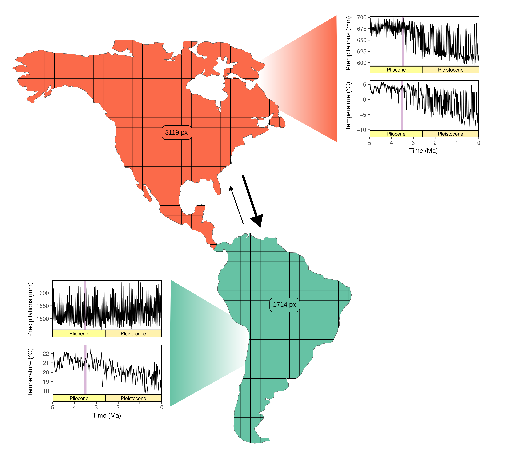
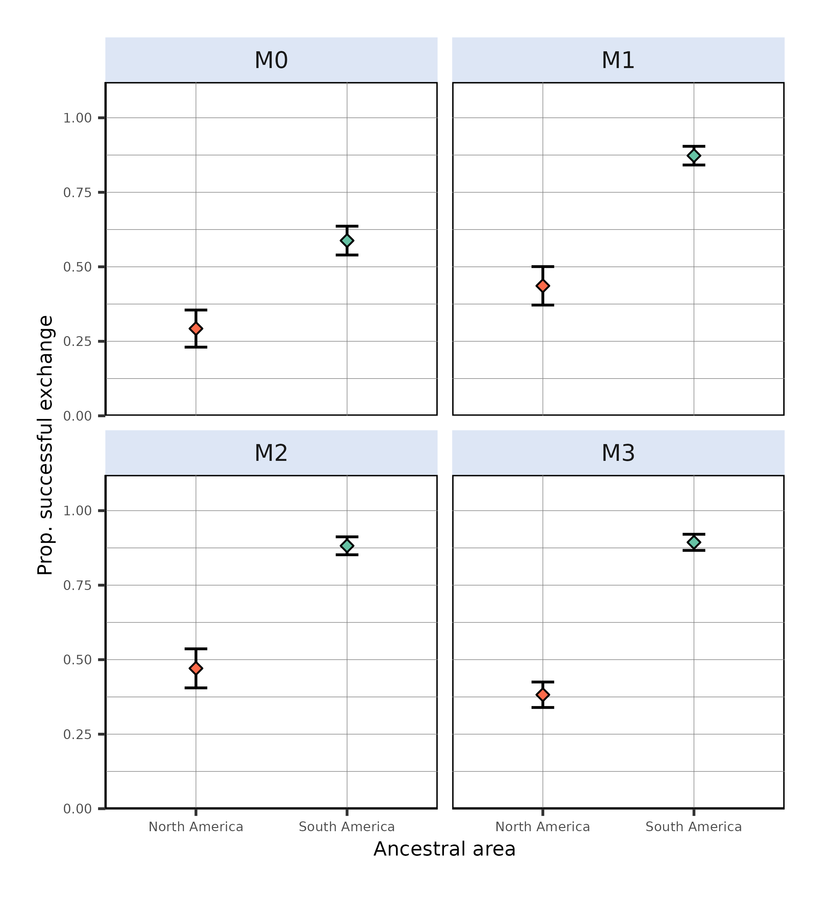
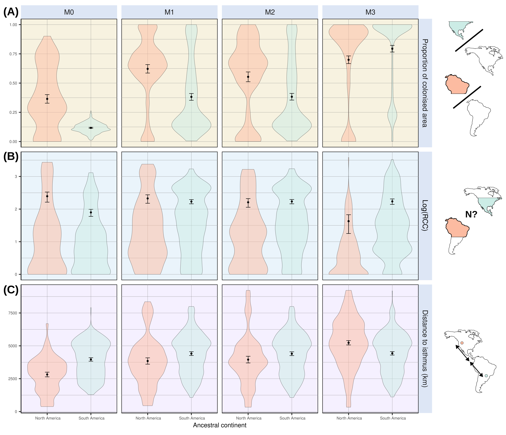
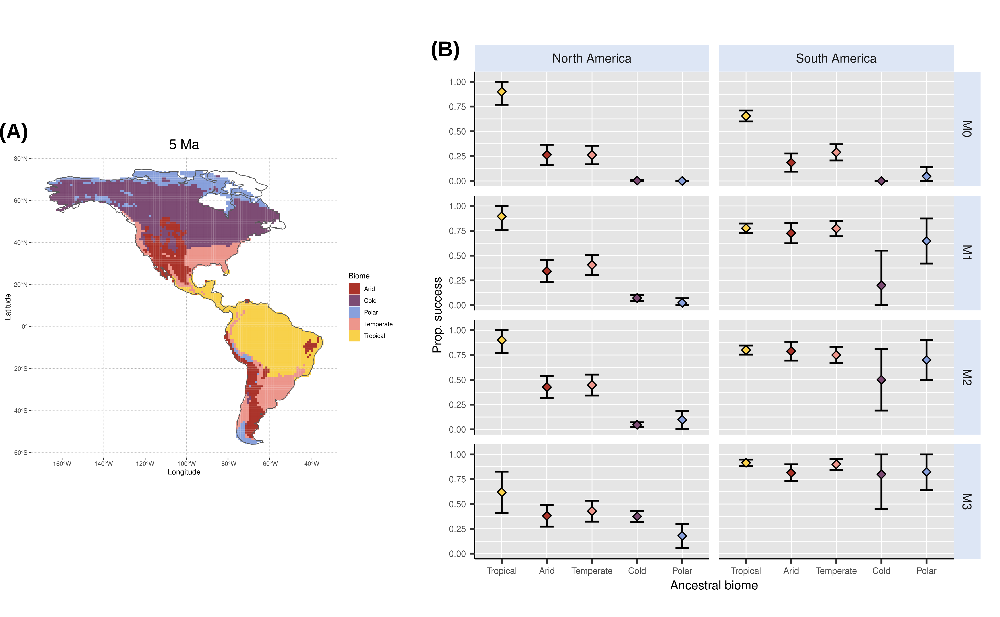

Affiliations:

¹ Institut des Sciences de l’Evolution de Montpellier, Université de Montpellier, CNRS, IRD, Place Eugène Bataillon, 34095 Montpellier cedex 5, France.

² Centro de Investigación Mariña, Departamento de Ecoloxía e Bioloxía Animal, Universidade de Vigo, Campus Lagoas-Marcosende, 36310 Vigo, Spain

# Abstract

The Great American Biotic Interchange (GABI) refers to the admixture of North and South American faunas promoted by the late Cenozoic closure of the isthmus of Panama. Among land mammals, this faunal exchange was asymmetric because it witnessed a greater ability of North American lineages to establish southwards, meanwhile many South Americans went extinct. Here, coupling a mechanistic eco-evolutionary simulator with palaeoclimatic reconstructions for the last 5 million years, we explore the extent to which palaeoclimate, alone, may have shaped such a biogeographic asymmetry. When climatic variables are the only constraints to virtual species' dispersal, our results indicate that (1) successful interchanges are more frequently achieved when simulations start from South America than from North America, contrary to what could be expected based empirical observations. In addition, (2) our models fail at explaining the higher representation of temperate-adapted mammals in the fossil record of successfully exchanged mammals, particularly of North American origin, but (3) suggest that successful colonisers from North America occupy larger areas in South America than the other way around. Hence, our findings stress that spatio-temporal palaeoclimate dynamics are not sufficient to explain the imbalanced success of North American migrants in South America following the GABI, suggesting the implication of additional biogeographic and ecological filters. This study offers valuable insights into the processes behind one of the most puzzling macroecological enigmas in the history of life on Earth.

# Keywords

Eco-evolutionary simulations; Mammals; Macroecology; Palaeoclimate \newpage

# Introduction

The Great American Biotic Interchange (GABI) refers to the large-scale faunal exchange -- mostly affecting land mammals -- that occurred between the Americas, favoured by the closure of the isthmus of Panama [@marshall1982]. Though the exact timing of the appearance of such a landbridge is not entirely resolved [@montes2015; @jaramillo2018; @odea2016], palaeontological evidence and molecular phylogenies both agree with a late Miocene onset of land mammal exchange between the Americas [@verzi2008; @tedford2004], with effective pulses of mammal crossings occurring not earlier than *c.* 3 Million years ago [@marshall1982; @woodburne2010; @bacon2015; @bacon2016]. Despite its textbook nature, a puzzling feature of the GABI is that it impacted both continent's mammalian faunas very differently. In fact, evidence from the fossil record indicates that the early phases of the GABI were marked by reciprocal exchanges between the Americas [@webb1976; @marshall1982; @woodburne2010]. However, during the Quaternary, the ability of migrant lineages to maintain and diversify in the foreign continent became greater in South America [@woodburne2010], and many native South American mammal lineages concomitantly declined, some of which even going totally extinct [@webb1991; @cione2015; @carrillo2020; @croft2020; @boscaini2025]. Hence, it turns out that this intercontinental faunal exchange has been strikingly asymmetric.

Although this macroecological imbalance is unquestionable, so far, no clear consensus regarding the forces underlying this asymmetry has been established. On one hand, biotic interactions involving migrant and native species have often been proposed to this aim. These would include competition [@webb1976; @simpson1980; @domingo2020] or predation of predator-naive preys [@webb1976; @marshall1990; @faurby2016; @fernández-monescillo2025]. However, their contribution to the asymmetry of the GABI has been increasingly called into question [*e*.*g*., @vrba1992; @prevosti2013; @tarquini2022; @marsà2025]. On the other hand, several studies also proposed an implication of abiotic factors -- *i*.*e*., related to species' physical environment, such as climate $^{e.g.,}$ [@marshall1990; @vrba1992; @webb1991; @bacon2016; @freitas-oliveira2024]. The prevailing view, proposed by Webb. [@webb1991] and Vrba. [@vrba1992], consists of relating pulses of transcontinental mammal exchanges with Pleistocene climatic oscillations, promoting the transition from tropical rainforest to savannah-like environments in Central America as climate cooled down. This climate-driven landscape opening would have in turn facilitated the dispersal of non-tropical taxa, fitter to these environment, in line with the migrant fossil record across both sides of the isthmus. These exchange pulses would have been periodically interrupted as climate warmed up, promoting the reverse transition to rainforest in the isthmian region (tropical 'holding pen' hypothesis) [@woodburne2010]. However, so far, studies supporting this view have only been descriptive, tackling the issue from a pattern-oriented perspective driven by fossil data but, to our knowledge, never from a mechanistic process-oriented perspective.

Recent improvements in process-explicit modelling have marked a turning point in the study of biodiversity [@pilowsky2022]. By combining a landscape made up with palaeoenvironmental variables and a set of eco-evolutionary rules according to which virtual species are simulated, mechanistic eco-evolutionary models offer the unique opportunity to casually explore the way biodiversity patterns arise and are maintained through evolutionary times [@hagen2023]. Recently, this family of models has provided unprecedented insights into the underlying forces behind widely-recognised biodiversity patterns, such as the latitudinal biodiversity gradient [@hagen2021; @lorcery2025], the diversity desequilibrium between tropical rainforests across the globe [@hagen2021b], the build-up of the unique biodiversity along the Wallace line [@skeels2023b] and many others [*e*.*g*., @boschman2023; @skeels2023; @liu2024].

Here, we explore the implication of palaeoclimate change in the asymmetry of the GABI using a spatially-explicit mechanistic biodiversity simulator coupled with palaeoclimate reconstructions across the last 5 million years. Our simulations tracked the diversification of a clade either originating in North or South America. The ability of a virtual species to maintain at a given place was only mediated by climatic factors. We hypothesise that (i) simulations starting from a North American ancestor would be more successful at reaching the other continent than the other way around, (ii) successful simulations starting from a North American ancestor would result in a more diverse and spatially spread radiation in the foreign continent and (iii) successful interchange would be more frequently achieved among biome generalists, temperate and arid specialists rather than tropical specialists.

\newpage

# Results

## Climate makes northwards dispersal events easier than southwards ones

The contribution of palaeoclimate to the biogeographic asymmetry of the Great American Biotic Interchange (GABI) was tested in a simulation-based framework relying on gen3sis @hagen2021, a mechanistic eco-evolutionary simulator, incorporating palaeoclimatic layers (annual temperature and precipitation) covering the last 5 million years generated by the PALEO-PGEM emulator [@holden2019; @barreto2023]. Each set of simulations tracked the radiation of a clade originating at a random location either in North or South America. Climate was the only ecological constraint limiting virtual species' biogeography. We further compared the ability of virtual species to colonise the continent where they did not originate between the two initial conditions. For additional details, please refer to the *STAR Methods* section.

Our results suggest asymmetric proportions of simulations successfully reaching the other continent, being always higher -- by approx. a factor 2 -- when starting from South America than from North America (@fig-propsuccess). This imbalance is maintained whether we allow species climatic niche to evolve following the direction of local climatic change ($44\pm6\%$ vs. $87\pm3\%$, model $M1$) or not ($29\pm6\%$ vs. $59\pm5\%$, $M0$), though we can notice that overall transcontinental exchange frequencies are lower in the latter case. When allowing climatic niches to evolve, amputation of either their temperature ($47\pm7\%$ vs. $88\pm3\%$, $M2$) or precipitation ($38\pm4\%$ vs. $89\pm3\%$, $M3$) compounds did not alter the pattern. The characterised imbalance was also maintained when standardising initial distances to the isthmus of simulated species originating in North America to those of simulated species from South America, except for simulations generated under the zero-adaptationist model ($50\pm6\%$ vs. $59\pm5\%$) (Figure S2). This spatial standardisation aimed at controlling for the fact that simulations starting from South America originated on average closer to the isthmus than those starting from North America, therefore introducing a spatial bias (see *STAR Methods* and Figure S1).

That being said, out of the 500 runs carried out for each initial landmass-modelling scenario combination, the proportion of simulations leading to no living representative (=crash) was on average three times higher for simulations starting from North America, except for model $M3$, recording almost no crash (Table S2). This difference, although attenuated, persisted after the previously-introduced spatial standardisation procedure.

## Success on the foreign continent

Our findings highlight that, irrespective of the initial continent, at the final state, successful simulations generated under models allowing species climatic niches to evolve ($M1-M3$) colonised a larger area on the foreign continent -- quantified as the ratio between the number of pixels recording a presence in the landmass to colonise and the total number of pixels offered by this landmass -- than those generated under the $M0$ model -- where climatic niche evolution was not allowed (@fig-metrics A). Furthermore, virtual species of North American origin that successfully made it to South America generally colonised a greater area than those of South American origin reaching North America (@fig-metrics A). This pattern, particularly striking for simulations generated under the $M0$ model ($36.5\pm3.5\%$ vs. $11.7\pm0.4\%$), holds for all but the $M3$ model -- relaxing the precipitation constraint on virtual species' niche --, the latter suggesting an opposite trend ($69.9\pm3.3\%$ vs $79.4\pm3.9\%$).

Besides, contrary to the proportion of colonised area, for a given ancestral continent, colonised $\alpha$-diversity -- *i*.*e*., number of taxa within the colonised continent -- does not exhibit huge variations across our four models, though a significant decrease is to be reported for simulations starting from North America generated under the $M3$ model (@fig-metrics B). Moreover, ancestral continent does not seem to affect mean colonised $\alpha$-diversity values in the case of the $M1$ ($212\pm61$ vs. $170\pm25$ species respectively retrieved in the foreign continent after starting from North or South America) and $M2$ ($161\pm48$ vs. $171\pm27$ species) models. It does however affect

In addition, successful simulations starting from North America generally started from an ancestor located closer to the isthmus than those starting from South America (@fig-metrics C), again except for simulation generated under $M3$. Also, we can highlight a general trend that ancestral species originated closer to the isthmus in the case of successful simulations compared to unsuccessful ones (Figure S6-7). Interestingly enough, the results obtained for this metric, just like those obtained for the other two, hold for simulations generated after standardising the initial distances to the isthmus of North American virtual species with those starting from South America (Figure S3).

## Biome selectivity of the simulated faunal exchanges

We classified the climatic landscape at the time of the simulation onset ($t=5$ Million years ago, Ma) following the five broad climatic zones proposed by Beck et al. [@beck2018] and Galván et al. [@galván2023]: Tropical, Arid, Temperate, Cold and Polar (@fig-biome A). The ancestral species of each simulation was therefore assigned an initial biome based on the location of the site where it originated, randomly drawn within an equal-area grid overlaying our landscape (see *STAR Methods*). We propose simulations generated under the $M0$ model -- where climatic niche does not evolve -- to reflect the macroecological behaviour of biome specialists, maintaining an ecological affinity with the biome where they originated. On the other hand, species generated under the other models ($M1-3$) -- allowing climatic niche evolution over time -- were considered biome generalists.

Due to the unequal area occupied by each biome between the two continents, the number of simulations starting within each biome was largely uneven across biome classes and continents (@fig-biome B). The majority of North American ancestral species originated in the cold biome ($57\%$), whereas the tropical biome recorded the largest proportion of ancestral species origination in South America ($58\%$). Standardising initial distances to the isthmus of simulations originating in North America increased the proportion of simulations originating under low latitudes, to the detriment of those originating in high ones, less represented in South America (@fig-biome A and Figure S4). Consequently, this increased the representativity of the tropical (from $5\%$ to $10\%$) and arid (from $16\%$ to $26\%$) biomes in the starting ranges of simulations originating in North America, and decreased the proportion of simulations originating in the cold (from $57\%$ to $40\%$) and polar (from $4\%$ to $2\%$) ones (Figure S9).

Despite this initial imbalance, when simulations were generated under the $M0$ model, our results suggest similar exchange intensity patterns between simulations starting from North and South America (@fig-biome C, first row). Tropical specialists (*i*.*e*., originating in the tropical biome and evolving under $M0$) were largely more frequently exchanged than other biome specialists, with on average $90 [77,100]\%$ successful exchanges southwards (*i*.*e*., from simulations originating in North America) and $66\pm5\%$ northwards (*i*.*e*., from simulations originating in South America). Such proportions were significantly reduced for arid ($26\pm6\%$ southwards, $18\pm9\%$ northwards) and temperate specialists ($26\pm10\%$ southwards, $29\pm8\%$ northwards), and almost no cold or polar specialist, no matter where it originated, successfully made it to the other continent. The exact same pattern is obtained for southwards dispersal events occurring after standardising initial distances to the isthmus (Figure S8, $M0$).

Regarding biome generalists (models $M1-3$), simulations starting from North America maintained the same distribution of exchange intensities across biomes as biome specialists. Generalists that originated in the tropical biome record the highest proportion of exchange success ($89 [75, 100]\%$ for $M1$), followed by those originating in the temperate ($40\pm10\%$, $M1$) and arid ($34\pm11\%$, $M1$) biomes. Also, generalists originating in the cold or polar biomes almost never made it to South America (@fig-biome C $M1-2$). That being said, we should notice that removing the precipitation constraint on species climatic niche (*i*.*e*., model $M3$) tends to attenuate this imbalance (@fig-biome C $M3$). All this still hold when standardising initial distances to the isthmus of simulations starting from North America to those starting from South America (Figure S8, $M1-3$). Conversely, the disparity in proportion of successful exchanges across biomes was largely attenuated for biome generalists originating in South America, for which a successful exchange appears almost equally-likely, no matters the biome where they originate (@fig-biome C $M1-3$).

\newpage

# Discussion

Smoothing asymmetry =\> echo to birds [@weir2009], flying behaviour relaxing constraints applied to land mammals ?

Species pool proved relevant in the case of the interchange along the Wallacea [@skeels2023]. But here, we expect to find more species in South America, encompassing one of earth's major and long-standing biodiversity hotspot -- Amazonia [@antonelli2018] -- than in North America. That being said, some authors argued that it is not the case for genera, with North America having a higher 'proportion of reservoir genera' [@marshall1982; @vrba1992]

## Climate

Our results suggests that, under abiotic constraints, alone North America would have been easier to reach by South American species than the other way around (@fig-propsuccess).

One of the predictions of Vrba's resource-use hypotheses formulated in the framework of the habitat theory applied to the GABI is that tropical specialists, in the aftermath of the global cooling occurring in the Plio-Pleistocene boundary (decreasing trend visible on the temperature plots displayed in @fig-framework, from *c.* 3 Ma), would have been naturally attracted towards the equator following tropical belt's contraction, in turn actively promoting some North American mammal's establishment in South America @vrba1992. On the other hand, fewer mammals -- only biome generalists or open-habitat specialists -- from South America would be expected to roam the other way around. These predictions meet those of the 'tropical refugia' hypothesis formulated by Haffer [@haffer1969] a few decades earlier. The latter views the high diversity in the (Neo)tropics as a result of past climatic fragmentation of the tropical climatic region, generating discontinuities within populations of tropical-specialist species. In case of climatic disruption, tropical specialists would therefore follow the contraction-expansion of their habitat, in turn driving speciation by vicariance on evolutionary timescales [@haffer1969]. Here, our virtual experiments partially corroborate these historical predictions. Indeed, simulated tropical-adapted taxa of North American origin -- coming from simulations starting in the North American tropical biome and of which climatic niche could not evolve, model $M0$ -- have a higher prevalence of crossing the isthmus than other biome specialists of North American origin (@fig-biome B, model $M0$).

Success in South America for temperate-adapted species, posited as the most successful , not recovered, with tropical meeting the gighest success. "major overland dispersal of terrestrial mammalian taxa apparently did not take place until the climate was conducive to support the temperate-adapted taxa that experienced the changes in their respective home ranges" @woodburne2010


Biome pattern (Figure S6) directly reflects the diffential amount of surface that each biome represents in the two continents.

Precipitation niche @skeels2023b. Result of Figure 2C for $M3$ can be related to tropical biome

North American taxa exhibit strong Tropical Niche Conservatism (TNC), but not South Americans, except for M0. TNC relaxed in M3.

Effect of climate change to keep in mind for megafaunal extinctions @cruz2025

## On the effect of geography

One consistent pattern, however, is the fact that the prevalence of an intercontinental interchange gets higher as the ancestral species' coordinates get closer to the isthmus, which mirrors the results of Motta & Quental [@motta2025].

Imbalance in colonised area btwn SA and NA comes from the difference in pixel nb between both continents in our framework @fig-framework

Is it just about **reaching** or more about **reaching & surviving**?

## On the drivers behind the asymmetry of the GABI

Our study indicates that climate alone is not sufficient to reproduce the asymmetry of the GABI. This suggests that other factors, unaccounted here, might have been at work to shape the uneven faunal exchange that occured across the America. Among them, one can think about biotic interactions. In fact, in the first studies investigating the GABI, competition involving clades of similar ecology appeared as a likely first-order explanation to the recent demise of South American endemic mammalian clades such as native ungulates [@croft2020] or sparassodonts -- metatherian predators [@pino2022] -- that followed the establishment of northern lineages [@simpson1980]. Hypotheses invoking competition mostly relied on striking morphological convergences between the clades assumed to have competed -- *e*.*g*., sabertooth among predators, high-crowned and ever-growing cheek teeth among herbivores. In addition, evidence from stable isotope analyses of mammalian herbivore ennamel from Southern South America suggested that North American clades had broader trophic niches than their South American counterparts, this dietary flexibility therefore offering a larger adaptative power to North American herbivores in South America [@domingo2020]. Moreover, using phylogenetic regressions, Faurby et al. [@faurby2016] found support for another biotic interaction that could have played a role in shaping GABI's asymmetry: predation. They indeed characterised a higher prevalence of traits increasing prey susceptibility among the endemic South American mammals. However, several process-based analyses of the fossil record provided no evidence for biotic interactions involving native South American mammals and their northern counterparts [@prevosti2013; @tarquini2022]. Incorporating biotic compounds in mechanistic frameworks such as the one we have implemented here would be a nice way-to-go for future studies tackling the asymmetry behind the GABI.

Temporality (red queen vs. court jester, Benton 2001) =\> favouring biotic ?

Fortuitous experiment ?

## Limitations & perspectives

The landscape designed for the purpose of this study (@fig-framework) only permitted transcontinental faunal exchange via the isthmus of Panama, the closure of which being assumed as the main trigger of the GABI [@marshall1982]. Yet, the fossil record of the West Indies has provided evidence for faunal supply both from the South and the North American landmasses, in particular since the late Miocene [*e*.*g*., @morgan1993; @ali2021b]. Although over-water dispersal has long been regarded as the prevailing mechanism [@morgan1993], recent geological advances have providing evidence for (1) the emergence of land bridges connecting South America to Caribbean islands and (2) the formation of mega-islands -- during Pleistocene glacial maximum episodes -- several times since the Mio-Pliocene boundary @cornée2021. Hence, it would make sense to consider West Indies as an alternative dispersal pathway between the Americas. However, due to the idiosyncratic eco-evolutionary processes shaping insular systems [*e*.*g*., @warren2015] as well as the poor mention of West Indies as a stepping-stone in the literature of the GABI, we believe that considering this alternative route in our framework would rather deserve to be the topic of a study in itself.

Bias in the number of simulations crashing, with on average twice as many crashes when simulations started in North America when compared to those starting from South America. Also, an obvious spatial clustering of crashes in North America is to be reported, mainly affecting the centre of the landmass (temperate and cold biomes) **biome histogram + maps in SI**.

Assumption of fixed palaeogeography, particularly near the isthmus, whereas we know that this region changed across our study.

Higher proportion of colonised area could come from the different size of the continents, North America being wider both in terms of absolute surface and number of pixels.

Problem of taxonomic extinctions in Gen3sis!

Timeline of the simulation (last 5Myrs). Some claim for an onset of the interchange further back in time, but we justify our choice as (1) most studies agree with an onset of significant mammal exchange *c.* 3.5 Ma and (2) assumption of fixed palaeogeography.

# Acknowledgements

We thank Céline Devaux for her useful comments and feedbacks on the present work.

# Thrash

Throughout its evolutionary history, the biosphere has been repeatedly marked by the occurrence of geodispersal events, that is, exchanges of large species pools across landmasses [*e*.*g*., @couvreur2011, @upchurch2024].

These would include Pleistocene climate fluctuations and the consequent alternating phases of emergence of open landscapes across Central America, in turn favouring the dispersal of large temperate-adapted mammals to the detriment of tropical-adapted ones

Other studies proposed the implication of abiotic factors. Some put the emphasis on Pleistocene climate fluctuations and the consequent alternating phases of emergence of landscape opening across Central America, in turn favouring the dispersal of large temperate-adapted mammals to the detriment of tropical-adapted ones [@marshall1990; @webb1991; @bacon2016]. Others drew direct relationships between the higher extinction rates of native South American mammal genera and temperature change [@freitas-oliveira2024].

several studies proposed that palaeoclimate change shaped unequal dispersal abilities between northern and southern taxa [@marshall1990; @webb1991; @bacon2016; @freitas-oliveira2024], although the hypothesis according to which the asymmetry of the GABI would stem from dispersal rates is still largely debated [*e*.*g*., @carrillo2020].

\newpage

# References

::: {#refs}
:::

# Figures

```{r, echo=FALSE}
#| label: fig-framework
#| out-height: 11cm
#| out-width: 11cm
#| fig-cap: Average palaeoclimate histories within our studied landmasses. North America is displayed in coral red and South America in cyan. Spatially-averaged climate variables (Annual Temperature and Precipitation) are taken from the PALEO-PGEM palaeoclimate emulator @holden2019. This emulator being spatialised at a 1 x 1° resolution, numbers inside the continents represent the quantity of overlaying pixels from the climate grid within each continent. On climate plots, the time frame of the onset of significant land mammal exchange across the americas [@bacon2016; @woodburne2010] is indicated by the light purple vertical bands. Geological timescale was depicted using the deeptime R package [@gearty2023]. The empirically-derived asymmetry of the transcontinental land mammal exchange is represented by the thickness of the two arrows, the thicker the arrow, the more intense the exchange.


```

```{r, echo=FALSE}
#| label: fig-propsuccess
#| out-height: 10.5cm
#| out-width: 10cm
#| fig-cap: Proportion of simulations leading to a successful exchange to the other continent, computed as the ratio, given an initial continent and a modelling scenario, between the number of simulations leading to a transcontinental exchange and the total number of simulations resulting in at least one living species at the final state. From left to right are depicted the outcome of the zero-adaptationist model ($M0$, species climatic niche does not change through time -- climate specialists), full adaptationist model ($M1$, species climatic niche evolves following local changes in temperature and precipitations -- climate generalists) and alternative versions of $M1$ where species ecological niche is only determined by precipitation ($M2$) or temperature ($M3$). Each individual plot shows the outcome of simulations starting in North (red) and South (cyan) America. Dots represent mean proportion estimates and error bars show their associated Binomial-derived 95% confidence interval.



```

```{r, echo=FALSE}
#| label: fig-metrics
#| out-height: 12cm
#| out-width: 14cm
#| fig-align: "left"
#| fig-cap:  A few metrics summarising climate-mediated interchange derived from successful simulations, *i*.*e*., that resulted in a transcontinental faunal exchange. From left to right are shown the results of simulations generated under our four models (see @fig-propsuccess for details). **(A)** Proportion of foreign continent's colonised area, quantified as the ratio between the number of pixels recording a presence in the landmass to colonise and the total number of pixels offered by this landmass. **(B)** Colonised $\alpha$-diversity, expressed as the natural logarithm of the number of lineages within the colonised area. **(C)** Distances between the location where ancestral species originated and the isthmus of Panama, only for successful simulations -- *i*.*e*., successfully reaching the continent where it did not originate. Mean estimates and their associated Student-derived 95% confidence interval are displayed over their distribution. 



```

```{r, echo=FALSE}
#| label: fig-biome
#| out-height: 15cm
#| out-width: 15cm
#| fig-cap: Initial biome where each ancestral species leading to successful simulations is recorded at the time of the onset of the simulations (5 Ma). **(A)** Global main climate zones based on Köppen-Geiger biome classification at $t=5$ Ma. **(B)** Biome where the ancestral species of each of the 500 simulations originated, for each continent and each scenario. We removed simulations starting from a cell that could not be assigned a biome from our counts, hence the reason why some are not exactly summing to 500. **(C)** Proportion of successful simulations based on the biome where ancestral species originates, for each modelled scenario-ancestral continent combination. This proportion is expressed as the ratio between the number of successful simulations and the total number of simulations starting from a given biome. Coloured dots and error bars respectively show proportion estimates and their associated Binomial-derived 95% confidence intervals.


```
