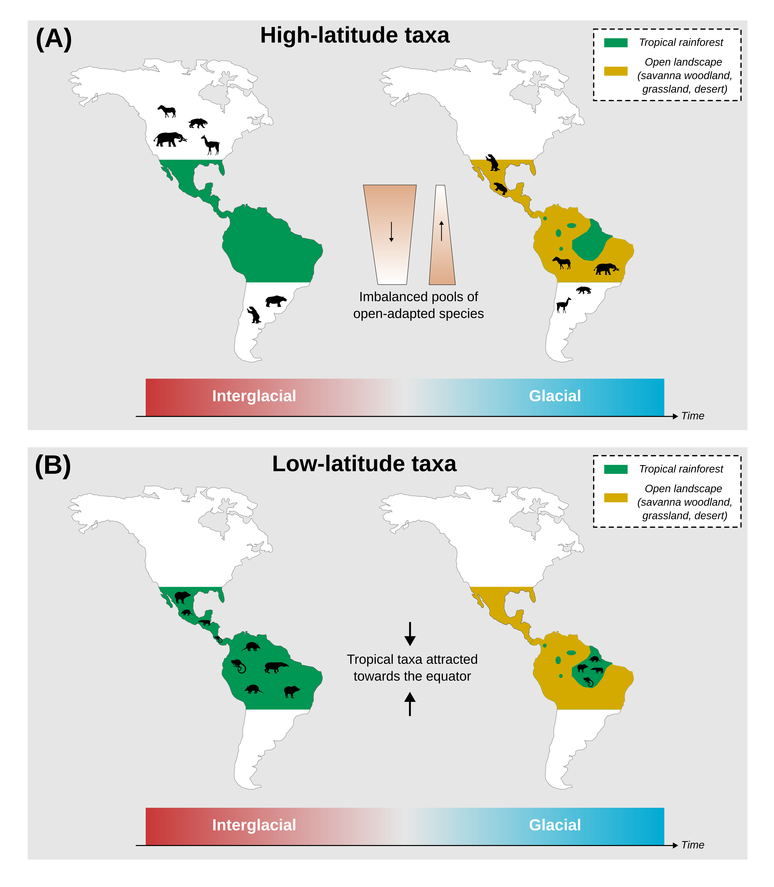

Affiliations:

¹ Institut des Sciences de l’Evolution de Montpellier, Université de Montpellier, CNRS, IRD, Place Eugène Bataillon, 34095 Montpellier cedex 5, France.

² Centro de Investigación Mariña, Departamento de Ecoloxía e Bioloxía Animal, Universidade de Vigo, Campus Lagoas-Marcosende, 36310 Vigo, Spain

\* Corresponding author: lucas.l.buffan\@gmail.com

# Abstract

The Great American Biotic Interchange (GABI) refers to the admixture of North and South American faunas facilitated by the Mio-Pliocene closure of the isthmus of Panama. For some groups, in particular land mammals, this faunal exchange was asymmetric: a greater number of North American lineages successfully established southwards, meanwhile many South Americans went extinct. Despite the unquestionable nature of this macroecological imbalance, the mechanisms underlying such an asymmetry remain debated. Here, coupling a mechanistic eco-evolutionary simulator with palaeoclimatic reconstructions for the last 5 million years, we test fundamental hypotheses relating such a biogeographic asymmetry to palaeoclimate dynamics. When climatic variables are the only constraints to species' dispersal, contrary to what could be expected based on empirical observations, our simulations indicate that taxa from South America disperse to the North more easily than the other way around, mostly within the tropical biome. In addition, our models fail at explaining the higher representation of temperate-adapted taxa in the fossil record of successfully-exchanged land mammals, particularly of North American origin, but suggest that successful colonisers from North America occupy larger areas in South America than the other way around. Hence, our findings stress that spatio-temporal palaeoclimate dynamics could not have made South America easier to reach than North America, suggesting additional factors were at play to shape the colonising (comprising reaching and successfully establishing within the new area) imbalance that characterised the GABI. This study offers new insights into the processes behind one of the most puzzling macroecological enigmas in the history of life on Earth.

# Keywords

Biotic Interchange; Eco-evolutionary simulations; Macroecology; Palaeoclimate \newpage

# Introduction

The Great American Biotic Interchange (GABI) refers to the large-scale biotic exchange that occurred between the Americas and intensified after the closure of the isthmus of Panama [@webb1976; @marshall1982; @stehli_great_1985]. Though the exact timing of the appearance of such a landbridge is not entirely resolved [@montes2015; @jaramillo2018; @odea2016; @bourke2025], palaeontological evidence and molecular phylogenies both agree with a late Miocene onset of (non-volant) biotic exchange between the Americas [@verzi2008; @tedford2004; @carrillo2015], with effective exchange pulses occurring during the Plio-Pleistocene [@marshall1982; @woodburne2010; @bacon2015; @bacon2016]. Among land mammals, a puzzling feature of the GABI is that it impacted both continental faunas very differently. In fact, evidence from the fossil record indicates that the early phases of the GABI were marked by reciprocal land mammal exchanges between the Americas [@webb1976; @marshall1982; @woodburne2010]. However, during the Pleistocene, the ability of migrant lineages to maintain and diversify in the newly-colonised continent became greater in South America [@woodburne2010], and many native South American mammal lineages concomitantly declined, some of which even going totally extinct [@webb1991; @cione2015; @carrillo2020; @croft2020; @boscaini2025]. Hence, this intercontinental faunal exchange was asymmetric.

Although this macroecological imbalance is unquestionable, no clear consensus regarding the drivers underlying this asymmetry has been established yet. On the one hand, biotic interactions involving migrant and native species have often been proposed to explain such an asymmetry. These would include competition [@webb1976; @simpson1980; @domingo2020] or predation of predator-naive preys [@webb1976; @marshall1990; @faurby2016; @fernández-monescillo2025]. However, their contribution to the asymmetry of the GABI has been increasingly called into question [*e*.*g*., @vrba1992; @prevosti2013; @tarquini2022; @marsà2025; @freitas-oliveira_no_2024]. On the other hand, several studies also proposed the role of abiotic factors -- *i*.*e*., related to species' physical environment, such as climate $^{e.g.,}$ [@marshall1990; @vrba1992; @webb1991; @bacon2016; @freitas-oliveira2024; @freitas-oliveira2025]. The prevailing views consist of relating pulses of transcontinental mammal exchanges with Pleistocene climatic oscillations, promoting the transition from tropical rainforest to savannah-like environments in Central America as climate cooled down (@fig-hypotheses). Motivated by the migrant fossil record across both sides of the isthmus of Panama, Webb @webb1991 proposed that this climate-driven landscape opening would have facilitated the dispersal of open-adapted taxa. As those were assumed to be more numerous in North than in South America -- the former continent offering more high-latitude temperate-to-cold environments than the latter --, a larger number of North American taxa would be predicted to disperse to the South than the other way around (@fig-hypotheses A). The resulting exchanges would have been periodically interrupted as climate warmed up, promoting the reverse transition to rainforest in the isthmian region, with rainforests acting as a barrier for species dispersal (tropical 'holding pen' hypothesis) [@woodburne2010]. In addition, Vrba @vrba1992 proposed the contraction of tropical habitats towards the equator promoted by the aforementioned periodical climatic cooling to have mechanically attracted taxa suited to tropical environments southwards (@fig-hypotheses B). However, studies supporting these views have only been descriptive, tackling the issue from a pattern-oriented perspective driven by fossil data but, to our knowledge, never from a process-oriented perspective.

Recent improvements in process-explicit modelling have marked a turning point in the study of biodiversity [@pilowsky2022]. By combining a landscape including palaeoenvironmental variables and a set of eco-evolutionary rules according to which virtual species are simulated, mechanistic eco-evolutionary models offer the unique opportunity to causally explore how biodiversity patterns arise and are maintained through evolutionary times [@hagen2023]. Recently, this class of models has provided unprecedented insights into the underlying forces behind widely-recognised biodiversity patterns, such as the latitudinal biodiversity gradient [@hagen2021; @lorcery2025], the diversity desequilibrium between tropical rainforests across the globe [@hagen2021b], the build-up of the unique biodiversity along the Wallace line [@skeels2023b] and many others [*e*.*g*., @boschman2023; @skeels2023; @liu2024].

Here, we test Webb and Vrba's hypotheses on the role of palaeoclimate dynamics in the asymmetry of the GABI using a spatially-explicit mechanistic biodiversity simulator coupled with palaeoclimate reconstructions across the last 5 million years. Our simulations tracked the diversification of a clade originating either in North or South America. The ability of a virtual species to maintain at a given place was only mediated by climatic factors. We hypothesise that (i) simulations starting from a North American ancestor would be more successful at reaching the other continent than the other way around, (ii) successful simulations starting from a North American ancestor would result in a more diverse and spatially spread radiation in the newly-colonised continent, and (iii) successful interchange would be more frequently achieved among biome generalists, extratropical specialists rather than tropical specialists.

\newpage

# Results

## Climate makes northwards dispersal events easier than southwards ones

The contribution of palaeoclimate to the biogeographic asymmetry of the Great American Biotic Interchange (GABI) was tested in a simulation-based framework relying on gen3sis @hagen2021, a mechanistic eco-evolutionary simulator, incorporating palaeoclimatic layers (annual temperature and precipitation) covering the last 5 million years generated by the PALEO-PGEM emulator [@holden2019; @barreto2023] (@fig-framework). Each set of simulations tracked the radiation of a clade originating at a random location either in North or South America. Climate was the only ecological constraint limiting virtual species' biogeography. We further compared the ability of virtual species to colonise the continent where they did not originate between the two initial conditions. For additional details, please refer to the *STAR Methods* section.

Our results suggest that the proportion of simulations successfully reaching the other continent is always higher -- by approximately a factor of two -- when starting from South America than from North America (@fig-propsuccess). This imbalance holds whether we allow species climatic niche to evolve following the direction of local climatic change ($44\pm6\%$ vs. $87\pm3\%$, model $M1$) or not ($29\pm6\%$ vs. $59\pm5\%$, $M0$), although we can notice that overall transcontinental exchange frequencies are lower in the latter case. When allowing climatic niches to evolve, amputation of either their temperature ($47\pm7\%$ vs. $88\pm3\%$, $M2$) or precipitation ($38\pm4\%$ vs. $89\pm3\%$, $M3$) compounds did not alter the pattern. This imbalance was also maintained when standardising initial distances to the isthmus of Panama for simulated species originating in North America to those of simulated species from South America, except for simulations generated under the zero-adaptationist model ($50\pm6\%$ vs. $59\pm5\%$) (Figure S2). This spatial standardisation aimed at controlling for the fact that simulations starting from South America originated on average closer to the isthmus of Panama than those starting from North America, therefore introducing a spatial bias (see *STAR Methods* and Figure S1).

Out of the 500 runs carried out for each initial landmass-modelling scenario combination, the proportion of simulations leading to no living representative (=crash) was on average three times higher for simulations starting from North America, except for model $M3$, recording almost no crash (Table S2). This difference, although attenuated, persisted after the spatial standardisation procedure.

## Successful establishment on the newly-colonised continent

Irrespective of the initial continent, our findings highlight that successful simulations generated under models allowing species climatic niches to evolve ($M1-M3$) colonised a larger area on the newly-colonised continent -- quantified as the ratio between the number of pixels recording a presence in the landmass to colonise and the total number of pixels in this landmass -- than those generated under the $M0$ model -- where climatic niche evolution was not allowed (@fig-metrics A). Furthermore, species of North American origin that successfully made it to South America generally colonised a greater area than those of South American origin reaching North America (@fig-metrics A). This pattern is particularly striking for simulations generated under the $M0$ model ($36.5\pm3.5\%$ vs. $11.7\pm0.4\%$), and holds for all but the $M3$ model -- relaxing the precipitation constraint on species' niche --, the latter suggesting an opposite trend ($69.9\pm3.3\%$ vs $79.4\pm3.9\%$). However, due to the difference in size (*i*.*e*., number of pixels) between the two continents (@fig-framework), the actual colonised area (quantified as the number of colonised cells in our simulations) was greater when simulations generated under the $M1-3$ models started from South than North America, but remained larger when simulations were generated under $M0$ started from North America (Figure S12).

Besides, contrary to the proportion of colonised area for a given ancestral continent, colonised diversity (*i*.*e*., the number of taxa within the colonised continent) does not vary significantly across our four models. However, a significant decrease is evident in simulations starting from North America generated under the $M3$ model (@fig-metrics B). Moreover, ancestral continent does not seem to affect mean colonised diversity values in the case of the $M1$ ($212\pm61$ vs. $170\pm25$ species respectively retrieved in the newly-colonised continent after starting from North or South America) and $M2$ ($161\pm48$ vs. $171\pm27$ species) models. It does however have an effect for simulations generated under $M0$, with higher average values obtained for simulations starting from North America ($247\pm85$ vs. $79\pm20$ species).

In addition, successful simulations starting from North America generally started from an ancestor located closer to the isthmus of Panama than those starting from South America (@fig-metrics C), again except for simulation generated under $M3$. Also, we can highlight a general trend that ancestral species originated closer to the isthmus in the case of successful simulations compared to unsuccessful ones (Figure S6-7). Interestingly enough, the results obtained for this metric, just like those obtained for the other two, hold for simulations generated after standardising the initial distances to the isthmus of North American virtual species with those starting from South America (Figure S3).

## Biome selectivity of the simulated faunal exchanges

We classified the climatic landscape at the time of the simulation onset ($t=5$ million years ago, Ma) following the five broad climatic zones proposed by Beck et al. [@beck2018] and Galván et al. [@galván2023]: Tropical, Arid, Temperate, Cold and Polar (@fig-biome A). For each simulation, the ancestral species was therefore assigned an initial biome based on the location of the site where it originated, randomly drawn within an equal-area grid overlaying our landscape (see *STAR Methods*). Simulations generated under the $M0$ model -- where climatic niche does not evolve -- reflect the macroecological behaviour of biome specialists, maintaining an ecological affinity with the biome where they originated. On the other hand, species generated under the other models ($M1-3$) -- allowing climatic niche evolution over time -- were considered biome generalists.

Due to the unequal area occupied by each biome between the two continents, the number of simulations starting within each biome was largely uneven across biome classes and continents (@fig-biome B). The majority of North American ancestral species originated in the cold biome ($57\%$), whereas the tropical biome recorded the largest proportion of ancestral species origination in South America ($58\%$). Standardising initial distances to the isthmus of Panama for simulations originating in North America increased the proportion of simulations originating under low latitudes, to the detriment of those originating in high latitude, less represented in South America (@fig-biome A and Figure S4). Consequently, this increased the representativity of the tropical (from $5\%$ to $10\%$) and arid (from $16\%$ to $26\%$) biomes in the starting ranges of simulations originating in North America, and decreased the proportion of simulations originating in the cold (from $57\%$ to $40\%$) and polar (from $4\%$ to $2\%$) biomes (Figure S9).

Despite this initial imbalance, when simulations were generated under the $M0$ model, our results suggest similar exchange intensity patterns between simulations starting from North and South America (@fig-biome C, first row). Tropical specialists (*i*.*e*., originating in the tropical biome and evolving under $M0$) were largely more frequently exchanged than other biome specialists, with on average $90 [77,100]\%$ successful exchanges southwards (*i*.*e*., from simulations originating in North America) and $66\pm5\%$ northwards (*i*.*e*., from simulations originating in South America). Such proportions were significantly reduced for arid ($26\pm6\%$ southwards, $18\pm9\%$ northwards) and temperate specialists ($26\pm10\%$ southwards, $29\pm8\%$ northwards), and almost no cold or polar specialist, no matter where it originated, successfully made it to the other continent. The exact same pattern is obtained for southwards dispersal events occurring after standardising initial distances to the isthmus of Panama (Figure S8, $M0$).

Regarding biome generalists (models $M1-3$), simulations starting from North America maintained the same distribution of exchange intensities across biomes as biome specialists. Generalists that originated in the tropical biome record the highest proportion of exchange success ($89 [75, 100]\%$ for $M1$), followed by those originating in the temperate ($40\pm10\%$, $M1$) and arid ($34\pm11\%$, $M1$) biomes. Also, generalists originating in the cold or polar biomes almost never made it to South America (@fig-biome C $M1-2$). Note that removing the precipitation constraint on species climatic niche (*i*.*e*., model $M3$) tends to attenuate this imbalance (@fig-biome C $M3$). All this still holds when standardising initial distances to the isthmus of Panama of simulations starting from North America to those starting from South America (Figure S8, $M1-3$). Conversely, the disparity in proportion of successful exchanges across biomes was largely attenuated for biome generalists originating in South America, for which a successful exchange appears almost equally-likely, regardless of the biome where they originate (@fig-biome C $M1-3$).

# Discussion

## An inverse asymmetry of exchange driven by climate

Throughout this work, we investigated the role of palaeoclimate in the asymmetry of the GABI through the use of eco-evolutionary simulations. Based on empirical evidence, we hypothesised our virtual experiments to result in (i) a higher likelihood of southwards dispersal events (*i*.*e*., from North to South America) compared to northwards ones; (ii) more diverse and spatially spread radiations in the newly-colonised continent following successful southwards exchanges compared to northwards ones; and (iii) successful exchanges to be more frequently achieved among simulated biome generalists, temperate and arid specialists than tropical specialists.

Probably one of our most striking findings is that, under climatic constraints alone, simulated South American lineages dispersed to the North with a significantly greater probability than the other way around (@fig-propsuccess). This therefore clearly contrasts with the long-recognised imbalanced success of North American mammal taxa compared to South Americans in the aftermath of the GABI @simpson1980. It may suggest that the asymmetric land mammal exchange that resulted from the GABI must have been shaped by additional factors than climate alone. This result might have broader implications in biogeography, a discipline where climate has been used as the main factor explaining the distribution limits and the range dynamic of species.

Seminal works primarily interpreted the empirically-derived asymmetry of the GABI through the lens of a continent-wide extension of the MacArthur & Wilson's equilibrium theory @macarthur1967. The latter theory establishes that, on evolutionary timescales, diversity within a given area should tend towards an equilibrium value proportional to the size of this area. Therefore, its continent-wide extension predicts the equilibrium diversity of North America to be larger than that of South America, given the differences in size between the two continents ($24$ vs. $18\times10^6$ km²). Following this framework, Marshall et al. @marshall1982 argued that the continent offering the largest pool of taxa -- which, according to this prediction, would be North America -- would in turn have resulted in the larger number of species exchanged in the end. It might be noticed that species pool imbalance between two source areas has been identified as a key driver in the faunal exchange asymmetry that contributed to the build-up of the unique biodiversity along the Wallace line @skeels2023b.

Nonetheless, following such a reasoning, the probability for a given taxon to cross the Panamanian landbridge is assumed to be independent from the side of the isthmus where it came from, which, interestingly, is not supported by our findings (@fig-propsuccess). In addition, this theory fails at explaining the actual imbalance in extant mammal species-level diversity between the Americas, being way larger in South than in North America [@willig2003; @raven2020].

Although the inverse asymmetry in climate-driven exchange across both sides of the Isthmus goes in contradiction with the mammal fossil record [*e*.*g*., @marshall1982], it actually echoes inter-American exchange patterns suggested by other groups of vertebrates. For instance, the extant South American amphibian fauna is almost entirely endemic [@lomolino2006]. By contrast, the North American frog fauna is composed of four families of southern origin, and only three of northern origin [@lomolino2006]. Just like herpetofauna, tropical North American ichtyofauna has long been recognised as mainly composed of groups that originated in South America and further dispersed to the North, although most likely multiple dispersal events occurred, some of which pre-dating the closure of the isthmus [*e*.*g*., @lomolino2006; @chakrabarty2011; @smith2012]. It should however be noted that, due to the requirement for connected freshwater networks, the magnitude of the faunal admixture among freshwater fishes has been greatly limited compared to land groups. Next, despite the higher dispersal abilities of birds (suggested by their mode of locomotion), phylogenetic evidence has shown a significant influence of the closure of the Panamanian Seaway in the rates of exchange between both continent's avifaunas [@weir2009; @smith2010]. In particular, these studies suggested that transcontinental exchanges occurred symmetrically among clades inhabiting tropical regions, but interestingly, just like land mammals, diversification of extra-tropical groups to tropical regions and further dispersal to the other landmass was strongly asymmetrical in favour of North American groups [@smith2010; @smith2012]. That being said, notable exceptions of South American bird groups that successfully diversified in North America (including within temperate regions) exist, such as hummingbirds [*e*.*g*., @wallace1878]. However, the lack of fossil record for all the aforementioned groups greatly hampers the understanding of the processes behind their biogeographic history. Last, the Central American flora has been characterised as a mixture of lineages of North and South American origins, but phylogenetic evidence have suggested that the arrival of taxa from South America largely predated the established timeline of the GABI [*e*.*g*., @cody2010]. Nevertheless, the orchid flora of the Chocó region, bridging the north-western coast of South America and southern Panama, was found to be primarily made up with Andean − thus, South American − lineages that radiated locally not earlier than 5 million years ago [@pérez-escobar2019].

## Revisiting climatic paradigms of the Great American Biotic Interchange

One of the predictions of Vrba’s resource-use hypotheses, formulated within the framework of habitat theory and applied to the GABI, is that tropical specialists would have been naturally attracted towards the equator following the contraction of the tropical belt in the aftermath of the global cooling occurring at the Plio-Pleistocene boundary (@fig-hypotheses B; @fig-framework, from *ca*. 3 Ma). This would have actively promoted the establishment of North American tropical specialists in South America @vrba1992. This prediction meets the 'tropical refugia' hypothesis formulated a few decades earlier [@haffer1969]. The latter hypothesis views the high diversity in the (Neo)tropics as a result of past climatic fragmentation of the tropical climatic region, generating discontinuities within populations of tropical taxa. In case of climatic disruption, tropical taxa would therefore follow the contraction-expansion of their habitat, in turn driving speciation by vicariance on evolutionary timescales [@haffer1969]. Here, our virtual experiments partially corroborate these historical predictions. Indeed, simulated tropical generalists of North American origin -- coming from simulations starting in the North American tropical biome and of which climatic niche could not evolve, model $M0$ -- were found to have a high prevalence of crossing the isthmus (@fig-biome C, model $M0$). However, the prevalence of tropical specialists from South America to disperse to the North was found to be almost equally-high, largely exceeding that of other biome specialists (@fig-biome C, model $M0$). This goes against Vrba's seminal hypothesis, instead predicting that fewer mammals -- only biome generalists or open-habitat specialists -- from South America would be expected to roam the other way around in case of tropical contraction towards the equator. This finding could reflect an attenuated magnitude of the climatic fragmentation of the Panamanian region when compared to historical biome reconstructions [*e*.*g*., @webb1991], with the persistence of a tropical corridor in turn promoting the exchange of tropical specialists between both landmasses.

On average, one simulated radiation of open biome -- *i*.*e*., arid or temperate -- specialists out of four resulted in a successful exchange, irrespective of its ancestral continent (@fig-biome C, model $M0$). This proportion is significantly lower than that obtained for tropical specialists. Yet, it has long been acknowledged that the migrant fossil record across both sides of the isthmus was essentially composed of taxa showing affinity with open biomes [*e*.*g*., @vrba1992]. Among the most emblematic, we find for instance equids, proboscids or camelids on the South American side, and ground sloths, toxodontids or glyptodontids on the North American side. The co-occurrence of distinct taxa in temporally well-delimited fossil assemblages led palaeontologists to postulate that the GABI was in fact a succession of exchange pulses punctuated by phases of interruption, further related to the climate-driven oscillations between savannah and rainforest in Central America during the Pleistocene [@webb1991]. Under such an assumption, the majority of exchanged taxa would therefore have ecologies suited to open habitats, and would have preferentially dispersed during Pleistocene glaciations [@woodburne2010; @bacon2016] (@fig-hypotheses A). As mentioned by Weir @weir2009, the American mammal fossil record is highly biased, with few occurrences coming from low-latitude tropical regions, which is particularly striking in South America [*e*.*g*., @ugarte2025; @buffan2025]. Furthermore, evidence from extant mammal taxa suggest a strong tropical niche conservatism, that is, the trend according to which newly-originated tropical taxa would remain inhabiting under tropical climates [@wiens2004; @smith2012]. Thus, the fossil-derived number of mammal exchanges must have been greatly underestimated, with little fossil evidence of interchange constrained to the tropical biome, as stressed by Carrillo [@carrillo2020]. Thus, one can wonder: could the empirically-derived migration imbalance in favour of North American taxa dispersing southwards be altered by the tropical niche conservatism of south-to-north migrants, thereby obscuring the actual number of intercontinental exchanges?

Our findings revealed that radiations following a colonisation of South America were more spatially spread than those arising from a northwards dispersal, except for simulations generated under the $M3$ model (@fig-metrics A). The spatial spread of a migrant radiation was measured by the proportion of cells occupied within the newly-colonised continent relative to the size of the latter. When focusing on the absolute number of cells colonised -- therefore without controlling for the area, in terms of number of cells, of the newly-colonised continent -- such a finding only holds for successful simulations generated under $M0$ (Figure S12). This mirrors the fact that simulated tropical specialists from South America were more intensively exchanged than other simulated biome specialists (@fig-biome C). The imposed tropical niche conservatism therefore constrained them to remain in tropical regions of North America, that are less represented in tropical North America than in South America (@fig-biome A). This adds some evidence supporting the fact that climate would have permitted South-to-North tropical exchanges to take place, but might have been obscured by a subsequent taphonomic bias in the fossil record, as suggested by studies relying on dated phylogenies [@bacon2015; @carrillo2020]. Hence, our study calls for thinking about the distinction between the ability to disperse towards, and ability to maintain within the foreign area. Those two distinct processes may have been ruled by different factors.

Our simulations cast doubt on the interplay between the aforementioned exchange pulses and temperature fluctuations, as exemplified by the combined times of occurrence of all successful exchanges (either southwards or northwards, depending on whether the simulation started from North or South America) occurring in all the simulations generated under a given landmass-scenario combination (Figure S11). In the case of northwards dispersal events, a gradual increase in exchange frequency from the Plio-Pleistocene boundary onwards is to be reported (Figure S11, *right*). This might reflect the average waiting time that virtual radiations take to reach the isthmian zone, directly proportional to their initial distance to the isthmus (Figure S4−5). Note that this explanation does not invoke any implication of climate. Regarding southwards exchanges, the same pattern seems to arise for simulations generated under the $M1$ model, but not under $M0$ (Figure S11). The distribution of the exchange times in the latter case rather exhibits sporadic pulses *ca.* 0.2, 0.5, 0.8, 1.2, 1.9, 2.5 Ma, which could match with some temperature minima, but accurately testing such an observation would require additional data. Rather, the sporadic character of exchange pulses in that case could simply come from the relatively low amount of successful simulations as compared to other modelling scenarios (Table S3). Overall, our simulations suggest that the relationship between temperature minima and pulses of faunal exchange between the Americas seems to be more complex than previously stated $^{e.g.,}$[@webb1991; @vrba1992; @woodburne2010; @freitas-oliveira2024; @freitas-oliveira2025].

Our findings nevertheless leave some space for possible random effects purely related to geography. Indeed, irrespective of the initial landmass, successful simulations originated on average closer to the isthmus of Panama than unsuccessful ones (Figures S6--7). This may suggest that some simulations were unsuccessful not only because of climatic filters, but also because they simply started too far from the landbridge and did not have the chance to reach it throughout the duration of the simulation. The relationship between the success of a taxon to make it to the other continent and the distance between its geographic range and the isthmus of Panama has long been postulated in the literature [*e*.*g*., @simpson1980]. Webb @webb1991 greatly illustrated this view with the example of antilocaprids, that "were probably capable of living somewhere in the Andes, [but] were simply too far from the isthmian link to make the exodus". Pursuing such a reasoning, a recent study characterised a negative correlation between the proportion of migrant taxa within fossil assemblages of either North or South America and the distance of the fossil assemblage to the Panamanian landbridge [@motta2025]. Therefore, geographic contingency must have also had a significant role to play in the asymmetry of the GABI.

## Limitations and perspectives

Differences in the pace at which migrant and native lineages diversified have long been proposed to play a significant role in the asymmetry of the GABI. By reconstructing raw macroevolutionary dynamics from the fossil record, Marshall et al. @marshall1982 highlighted that northern immigrant genera experienced notoriously higher origination and lower extinction rates than native lineages in South America. More recently, using a Bayesian framework accounting for preservation heterogeneities to infer fossil-based macroevolutionary trends, Carrillo et al. @carrillo2020 showed that the asymmetry of the GABI was not due to differences in origination or dispersal rates, but rather in extinction rates: native South American lineages experienced more extinctions in their home range than migrant lineages. In our simulations, for a species to go extinct, it needs to disappear from each cell across the landscape. As environmental filtering -- in our case, the only force driving diversification -- acts at the scale of a pixel, species extinction is therefore very rare. As a result, our framework did not allow us to relate the simulated environment-dependent inter-American faunal exchange with any diversification process. Realistic modelling of macroevolutionary processes is therefore an avenue towards improvements among mechanistic eco-evolutionary simulators, particularly in the framework of the GABI.

Also, we evidenced a nuance between the proportion of colonised area and the absolute colonised area (@fig-metrics and S13) simply comes from the imbalanced number of pixels between the two landmasses, being around two times larger for North America than for South America (@fig-framework). A possible avenue to avoid such confusions when carrying eco-evolutionary simulations at such a broad spatial scale (here from *ca*. 80° N to *ca*. 40° S lat) would be to use equal-area landscapes. In our case, this would require conversions in the palaeoclimate simulations that we use, as well as adapting dispersal probabilities based on actual distances rather than equal-degree pixels.

In addition, the main message of our study is that climate alone is not sufficient to explain the asymmetry of the GABI. This suggests that other factors, unaccounted here, might have been at work to shape the uneven faunal exchange that occurred across the Americas. Among them, one can think about biotic interactions. In fact, in the first studies investigating the GABI, competition involving clades of similar ecology appeared as a likely first-order explanation to the recent demise of South American endemic mammalian clades such as native ungulates [@croft2020] or sparassodonts -- metatherian predators [@pino2022] -- that followed the establishment of northern lineages [*e*.*g*., @simpson1980]. Convinced that the overwhelming success of North American mammals in South America could "*not be pure coincidence*", Simpson @simpson1950 proposed this imbalance to come from the different levels of connectivity with other landmasses between North and South America throughout the Cenozoic. Whereas South America mostly evolved as an isolated continent, North America has been repeatedly connected to other landmasses, promoting faunal exchanges. Lineages that maintained in the aftermath of such connection therefore had to cope with eventual competition with other groups, which was not the case of South American fauna. However, several process-based analyses of the fossil record provided no evidence for biotic interactions involving native South American mammals and their northern counterparts [*e*.*g*., @prevosti2013; @tarquini2022]. Hence, incorporating biotic compounds in mechanistic frameworks such as the one we have implemented here would be a worthy avenue for future studies tackling the asymmetry behind the GABI.

Last, the landscape designed for the purpose of this study (@fig-framework) only permitted transcontinental faunal exchange via the isthmus of Panama, the closure of which being assumed to be the main trigger of the GABI [@marshall1982]. Yet, the fossil record of the Caribbean Islands has provided evidence for faunal supply both from the South and the North American landmasses, in particular since the late Miocene [*e*.*g*., @morgan1993; @macphee2011]. Although over-water dispersal has long been regarded as the prevailing mechanism [@morgan1993], recent geological advances have provided evidence for (1) the emergence of land bridges connecting South America to Caribbean Islands and (2) the formation of mega-islands -- during Pleistocene glacial maximum episodes -- several times since the Mio-Pliocene boundary @cornée2021. Hence, it would make sense to consider the Caribbean Islands as an alternative dispersal pathway between the Americas, as shown to be the case in earlier time frames, for instance, near the Eocene--Oligocene boundary (*i*.*e*., GAARlandia hypothesis) [@cornée2021; @marivaux2020b]. However, due to the idiosyncratic eco-evolutionary processes shaping insular systems [*e*.*g*., @warren2015] as well as the poor mention of the Caribbean Islands as a stepping-stone in the literature of the GABI, we believe that considering this alternative route in our framework would rather deserve to be the topic of another study.

In summary, our findings do not support hypotheses exclusively relating the asymmetry of the GABI to palaeoclimate dynamics. Rather, our virtual experiments suggest that palaeoclimate would not have acted against exchange between tropical faunas of both continents, in turn stressing that the tropics did not act as a barrier, as previously stated. As they largely rely on the mammal fossil record, hypotheses relating the asymmetry of the GABI to palaeoclimate dynamics must have been affected by taphonomic bias, given the scarcity of fossil material in the tropical areas of the Americas. All this ultimately suggests that, despite being virtually able to make it to the other landmass, other factors unconsidered here must have been at play to prevent the establishment of endemic land mammals from South America in the other continent, in turn shaping the imbalance of the GABI.



# Acknowledgements

We thank Adrián Castro Insua for his useful guidelines and recommendations at the onset of the project. We thank Céline Devaux for her useful feedback on the present work. L.B. was funded by a grant offered by the École Normale Supérieure de Lyon.

# Author Contribution

S.V. and L.B. designed the project. L.B. ran the simulations, performed the analyses, produced the figures and wrote the manuscript with inputs from all co-authors.

# Declaration of Interests

The authors declare having no competing interests.



# References

::: {#refs}
:::

# Figures

```{r, echo=FALSE}
#| label: fig-hypotheses
#| out-height: 15cm
#| out-width: 12.5cm
#| fig-cap: The two nonmutually-exclusive hypotheses relating the asymmetry of the GABI to the Pleistocene climatic oscillations, formulated in the framework of land mammals. Both involve biome transition from close tropical rainforest (green) during interglacial periods − warm and humid − to open savannah/desert (dark yellow) during glacial maxima − cold and dry − in the isthmian region. The first one (A), formulated by Webb @webb1991 views the asymmetry of the GABI as the result from the fact that North America had a higher pool of open-adapted taxa than South America. The opening of the isthmian region acted as an ecological filter favouring the dispersal of these open-adapted taxa to the detriment of the others. Hence, given the imbalance in open-adapted pool size between the two continents, more species would have been expected to disperse to the South than the other way around. The second one (B), formulated by Vrba @vrba1992, proposes that the contraction of the tropical biome towards the equator triggered by the interglacial-glacial transition would have mechanically attracted tropical specialists southwards, irrespective of their continent of origin. Silhouettes are from phylopic, credits are available in Table S3.


```


```{r, echo=FALSE}
#| label: fig-framework
#| out-height: 11cm
#| out-width: 11cm
#| fig-cap: Average palaeoclimate histories within our studied landmasses. North America is displayed in coral red and South America in cyan. Spatially-averaged climate variables (Annual Temperature and Precipitation) are taken from the PALEO-PGEM palaeoclimate emulator @holden2019. This emulator being spatialised at a 1 x 1° resolution, numbers inside the continents represent the quantity of overlaying pixels from the climate grid within each continent. On climate plots, the time frame of the onset of significant land mammal exchange across the americas [@bacon2016; @woodburne2010] is indicated by the light purple vertical bands. The empirically-derived asymmetry of the transcontinental land mammal exchange is represented by the thickness of the two arrows, the thicker the arrow, the more intense the exchange.

knitr::include_graphics("../Figures/MS/Main/Figure_framework/Figure_framework.png")
```

```{r, echo=FALSE}
#| label: fig-propsuccess
#| out-height: 10.5cm
#| out-width: 10cm
#| fig-cap: Proportion of simulations leading to a successful exchange to the other continent, computed as the ratio, given an initial continent and a modelling scenario, between the number of simulations leading to a transcontinental exchange and the total number of simulations resulting in at least one living species at the final state. From left to right are depicted the outcome of the zero-adaptationist model ($M0$, species climatic niche does not change through time -- climate specialists), full adaptationist model ($M1$, species climatic niche evolves following local changes in temperature and precipitations -- climate generalists) and alternative versions of $M1$ where species ecological niche is only determined by precipitation ($M2$) or temperature ($M3$). Each individual plot shows the outcome of simulations starting in North (red) and South (cyan) America. Dots represent mean proportion estimates and error bars show their associated Binomial-derived 95% confidence interval.


knitr::include_graphics("../Figures/MS/Main/Figure_PropSuccess/Figure_PropSuccess.png")
```

```{r, echo=FALSE}
#| label: fig-metrics
#| out-height: 12cm
#| out-width: 14cm
#| fig-align: "left"
#| fig-cap:  A few metrics summarising climate-mediated interchange derived from successful simulations, *i*.*e*., that resulted in a transcontinental faunal exchange. From left to right are shown the results of simulations generated under our four models (see @fig-propsuccess for details). **(A)** Proportion of newly-colonised continent's colonised area, quantified as the ratio between the number of pixels recording a presence in the landmass to colonise and the total number of pixels offered by this landmass. **(B)** Colonised diversity, expressed as the natural logarithm of the number of lineages within the colonised area. **(C)** Distances between the location where ancestral species originated and the isthmus of Panama, only for successful simulations -- *i*.*e*., successfully reaching the continent where it did not originate. Mean estimates and their associated Student-derived 95% confidence interval are displayed over their distribution. 


knitr::include_graphics("../Figures/MS/Main/Figure_metrics/Figure_metrics.png")
```

```{r, echo=FALSE}
#| label: fig-biome
#| out-height: 15cm
#| out-width: 15cm
#| fig-cap: Initial biome where each ancestral species leading to successful simulations is recorded at the time of the onset of the simulations (5 Ma). **(A)** Global main climate zones based on Köppen-Geiger biome classification at $t=5$ Ma. **(B)** Biome where the ancestral species of each of the 500 simulations originated, for each continent and each scenario. We removed simulations starting from a cell that could not be assigned a biome from our counts, hence the reason why some are not exactly summing to 500. **(C)** Proportion of successful simulations based on the biome where ancestral species originates, for each modelled scenario-ancestral continent combination. This proportion is expressed as the ratio between the number of successful simulations and the total number of simulations starting from a given biome. Coloured dots and error bars respectively show proportion estimates and their associated Binomial-derived 95% confidence intervals.

knitr::include_graphics("../Figures/MS/Main/Figure_biomes/Figure_biomes.png")
```
