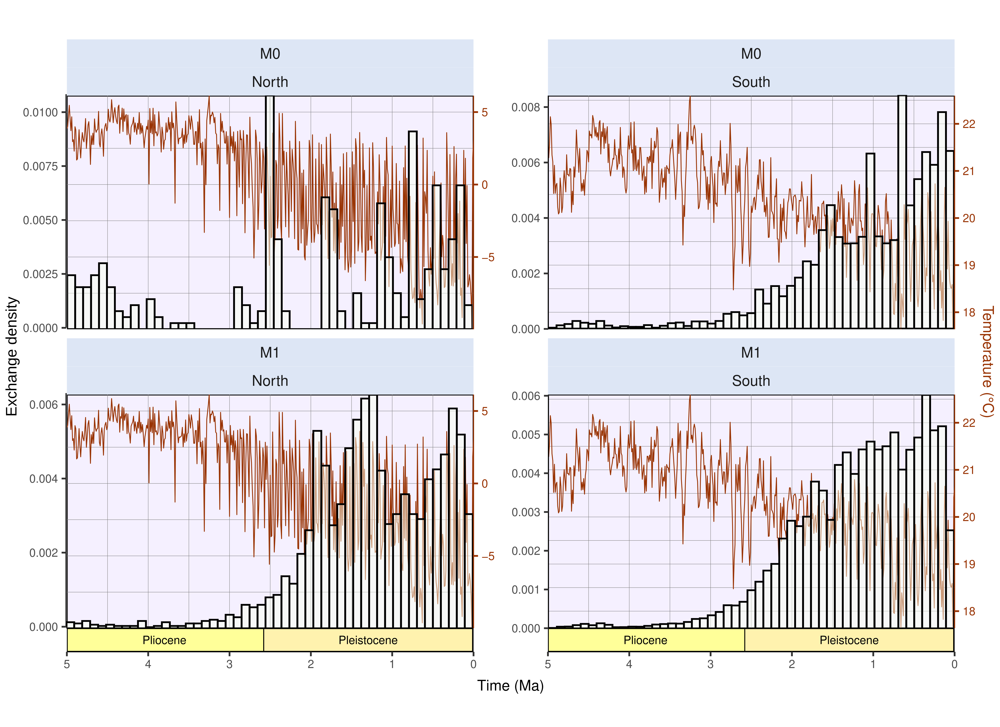

Affiliations:

¹ Institut des Sciences de l’Evolution de Montpellier, Université de Montpellier, CNRS, IRD, Place Eugène Bataillon, 34095 Montpellier cedex 5, France.

² Centro de Investigación Mariña, Departamento de Ecoloxía e Bioloxía Animal, Universidade de Vigo, Campus Lagoas-Marcosende, 36310 Vigo, Spain

\newpage

# Supplementary figures

All across the study, metrics computed out of simulations starting from North America are shown in coral red, and those starting from South America in cyan.

```{r, echo=FALSE}
#| label: fig-alldist
#| out-height: 8cm
#| out-width: 17cm
#| fig-cap: Initial distances to the isthmus of all simulations ($n=500$), either starting from North or South America. On the top row, locations of simlation's ancestral species resulted from a random landmass-scale equal-area sampling scheme, both starting from North and South America. On the bottom row, initial distances to the isthmus of simulations originating in North America were standardised to those of South America (see *STAR Methods*). Note that no change was made for simulations starting from South America.
 
knitr::include_graphics("../Figures/MS/Supp/metrics_std/panel_all_starting_distances.png")

```

```{r, echo=FALSE}
#| label: fig-propsuccess-std
#| out-height: 8cm
#| out-width: 16cm
#| fig-cap: Proportion of simulations leading to a successful exchange to the other continent after standardising initial distances to the isthmus of simulated species originating in North America to those of simulated species from South America (see *STAR Methods*). This proportion is computed as the ratio, given an initial continent and a modelling scenario, between the number of simulations leading to a transcontinental exchange and the total number of simulations resulting in at least one living species at the final state -- *i*.*e*., excluding crashes, see @tbl-crash. From left to right are depicted the outcome of the zero-adaptationist model ($M0$, species climatic niche does not change through time -- climate specialists), full adaptationist model ($M1$, species climatic niche evolves following local changes in temperature and precipitations -- climate generalists) and alternative versions of $M1$ where species ecological niche is only determined by precipitation ($M2$) or temperature ($M3$). Dots represent mean success proportion estimates and error bars show their associated Binomial-derived 95% confidence interval.


knitr::include_graphics("../Figures/MS/Supp/metrics_std/prop_successful_col_STD.png")
```

```{r, echo=FALSE}
#| label: fig-metrics-std
#| out-height: 15cm
#| out-width: 21cm
#| fig-cap: A few metrics summarising climate-mediated interchange after standardising initial distances to the isthmus of simulations starting from North America to those starting from South America. Each individual plot shows the outcome of simulations starting in North (red) and South (cyan) America. (*top*) Proportion of foreign continent's colonised area. (*middle*) Diversity within the colonised area. (*bottom*) Distance to the isthmus. The first two metrics have been computed out of successful simulations, *i*.*e*., that resulted in a transcontinental faunal exchange.
 
knitr::include_graphics("../Figures/MS/Supp/metrics_std/panel_area_div_dist_std.png")

```

```{r, echo=FALSE}
#| label: fig-AllStartRange
#| out-height: 22cm
#| out-width: 17cm
#| fig-cap: Starting range of all simulations either starting from North America (*left*), North America after standardising initial distances to the isthmus with those from South America (*middle*) or South America (*right*).

knitr::include_graphics("../Figures/MS/Supp/starting_ranges/Initial_ranges_All_runs.png")
```

```{r, echo=FALSE}
#| label: fig-SuccessStartRange
#| out-height: 22cm
#| out-width: 17cm
#| fig-cap: Starting range of successful simulations generated under each model (from $M0$ to $M3$), either starting from North America (*left*), North America after standardising initial distances to the isthmus with those from South America (*middle*) or South America (*right*).

knitr::include_graphics("../Figures/MS/Supp/starting_ranges/Initial_ranges_successful_runs.png")
```

```{r, echo=FALSE}
#| label: fig-InitDist
#| out-height: 8cm
#| out-width: 16cm
#| fig-cap: Comparison of the initial distance to the isthmus between successful and unsuccessful simulations of each of our four models, either starting from North (top) or South (bottom) America. Successful simulations ($Exchange$ $Sucess=1$) are displayed in green, whereas unsuccessful simulations ($Exchange$ $Sucess=0$) are displayed in yellow. Dashed lines on top and bottom of the distribution represent the 25% and 75% quantiles whereas the thicker full line in the middle shows the median (50% quantile).

knitr::include_graphics("../Figures/dist_to_isthm/distance_violin_panel_NoCRASH.png")
```

```{r, echo=FALSE}
#| label: fig-InitDistCrash
#| out-height: 8cm
#| out-width: 16cm
#| fig-cap: Comparison of the initial distance to the isthmus between successful and unsuccessful simulations of each of our four models including simulations that crashed (*i*.*e*., resulted in no living representative at the final time step), either starting from North (top) or South (bottom) America.  Successful simulations ($Exchange$ $Sucess=1$) are displayed in green, unsuccessful simulations ($Exchange$ $Sucess=0$) in yellow and simulation that crashed ($Exchange$ $Sucess=-1$) in grey. Dashed lines on top and bottom of the distribution represent the 25% and 75% quantiles whereas the thicker full line in the middle shows the median (50% quantile).

knitr::include_graphics("../Figures/dist_to_isthm/distance_violin_panel_CRASH.png")
```

```{r, echo=FALSE}
#| label: fig-ExchBiomeProp
#| out-height: 8cm
#| out-width: 17.5cm
#| fig-cap: Proportion of successful simulations starting from North America -- after standardising initial distances to the isthmus with simulations starting from South America (see *STAR Methods* and @fig-alldist) -- for each scenario. Coloured dots and error bars respectively show proportion estimates -- ratio between number of successful simulations and total number of simulations starting for a given biome -- and their associated Binomial-derived 95% confidence intervals.

knitr::include_graphics("../Figures/MS/Supp/biomes/starting_biome_EXCH_PROP_STD.png")
```

| 
| 

```{r, echo=FALSE}
#| label: fig-StdBiomeCount
#| out-height: 8cm
#| out-width: 17.5cm
#| fig-cap: Biome where the ancestral species of each of the 500 simulation originated, for each modelling scenario, starting from North America after standardising initial distance to isthmus with that of simulations starting from South America (see *STAR Methods* and @fig-alldist). We removed simulations starting from a cell that could not be assigned a biome from our counts, hence the reason why some are not exactly summing to 500.

knitr::include_graphics("../Figures/MS/Supp/biomes/starting_biome_STD.png")
```



```{r, echo=FALSE}
#| label: fig-ExchBiomeCount
#| out-height: 17cm
#| out-width: 23cm
#| fig-cap: Biome where the ancestral species of each simulation leading to a successful exchange originated, for each continent and each scenario.  "North America standardised" refers to simulations starting from North America after standardising initial distance to isthmus with that of simulations starting from South America (see *STAR Methods* and @fig-alldist).

knitr::include_graphics("../Figures/MS/Supp/biomes/starting_biome_EXCH.png")
```

```{r, echo=FALSE}
#| label: fig-exchange_timing
#| out-height: 12cm
#| out-width: 17cm
#| fig-cap: Distribution of the timing of southwards (*left*) and northwards (*right*) dispersal events across successful simulations, either generated by the $M0$ (*bottom*) or $M1$ (*bottom*) models. Histograms illustrate the frequency of exchanges retrieved throughout simulations per 100ky-long time bin (see *STAR Methods*). Brown curves in the background show continent-averaged annual temperature (BIO1) for either North or South America, coming from the PALEO-PGEM emulator @holden2019. Geological timescale was depicted thanks to the deeptime R package @gearty2023.



```

```{r, echo=FALSE}
#| label: fig-AbsColArea
#| out-height: 8cm
#| out-width: 17.5cm
#| fig-cap: Absolute colonised area, expressed as the number of foreign continent's occupied cells for each successful simulation generated under each model ($M0$--$M3$).

knitr::include_graphics("../Figures/MS/Supp/abs_col_area.png")
```



# Supplementary tables

```{r, echo=FALSE}
library(kableExtra)
```

```{r, echo=FALSE}
#| label: tbl-param
#| tbl-cap: Fixed parameter values for gen3sis simulations.
 
names <- c("`divergence_factor`", "`max_species`", "`max_coex_species`", "`start_species`", "`init_ab`", "`grid_cell_distance`")
values <- c(0.05, 10000, 1000, 1, 500, 111)
descr <- c("How much divergence disconnected populations accumulate across iterations",
           "Maximum number of simulated species a simulation can handle (if falls above, the simulation crashes)",
           "Cell carrying capacity",
           "Number of species to start with",
           "Initial abundance of the start species",
           "Distance (in km) between two grid cells of the landscape at the equator"
           )

fixed_params <- data.frame(Name = names, 
                           Value = values,
                           Description = descr)

# Display
knitr::kable(fixed_params, align = 'c')
```

| 
| 

```{r, echo=FALSE}
#| label: tbl-crash
#| tbl-cap: Proportion of simulations that crashed -- *i*.*e*., leading to no living representative at the end of the simulation -- for each modelling scenario ($M0-3$) depending on the ancestral area (`Start` column). "North America Standardised" refers to simulations carried out from a North American ancestor after standardising initial distances to Isthmus with simulations starting from South America (see *STAR Methods*)

prop_crash_unstd <- readRDS("../Results/Exchanged_metrics/Crash_counter.RDS")

knitr::kable(prop_crash_unstd, align = "c")
```

| 
| 

```{r, echo=FALSE}
#| label: tbl-RefSilhouettes
#| tbl-cap: References for the silhouettes used in Figure 1, from Phylopic.

library(readxl)
tbl <- read_xlsx("./phylopic_ID_table.xlsx")
# Italicise species names
tbl$Silhouette <- sapply(X = tbl$Silhouette, FUN = function(x){paste0("*", x, "*")})
# Header in bold
colnames(tbl) <- sapply(X = colnames(tbl), FUN = function(x){paste0("**", x, "**")})

# Display
knitr::kable(tbl, align = "c")
```



# Supplementary references

::: {#refs}
:::
