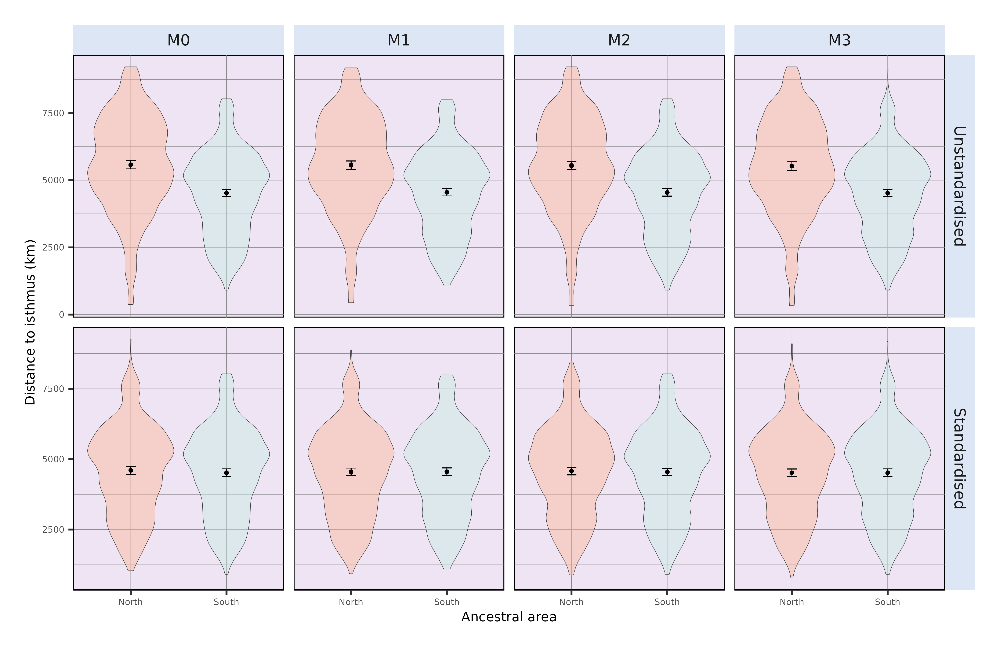
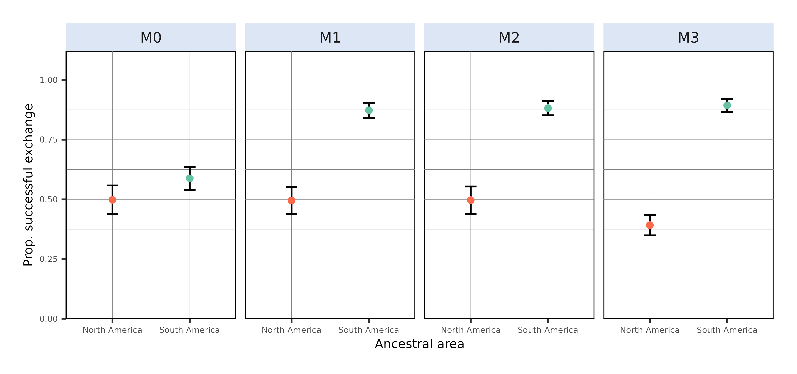
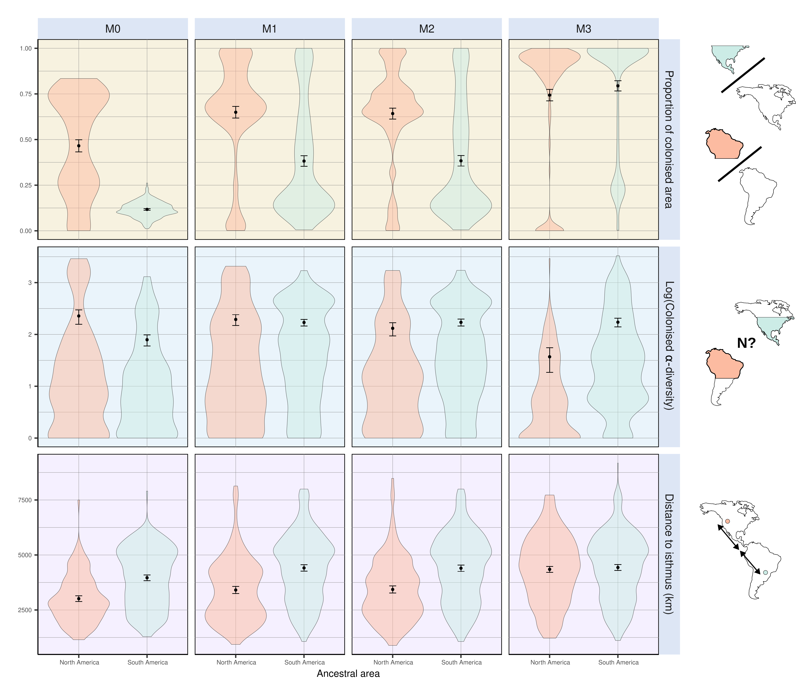
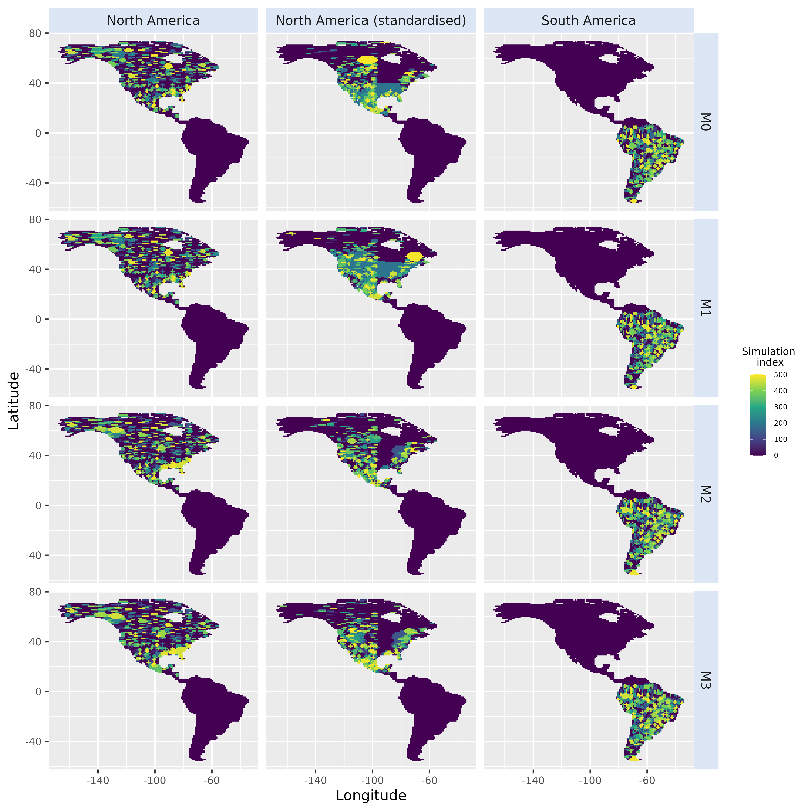
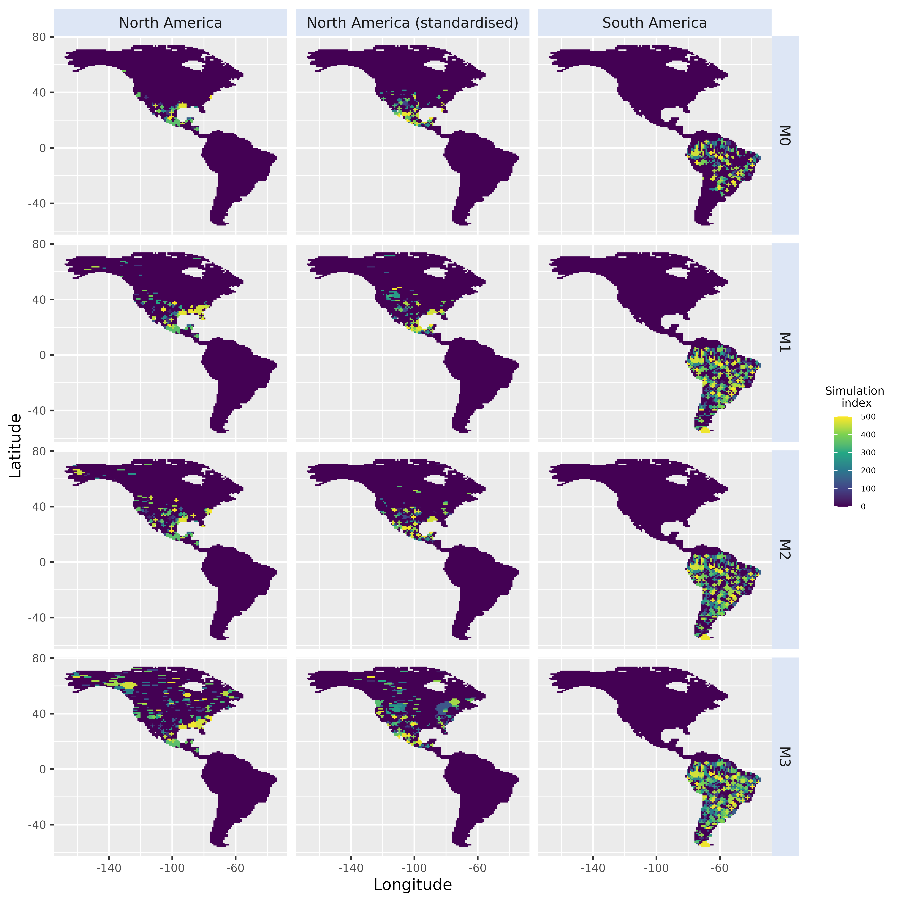
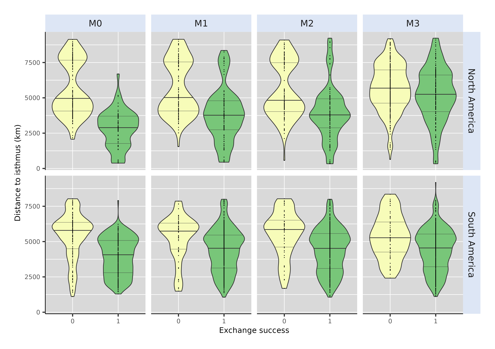
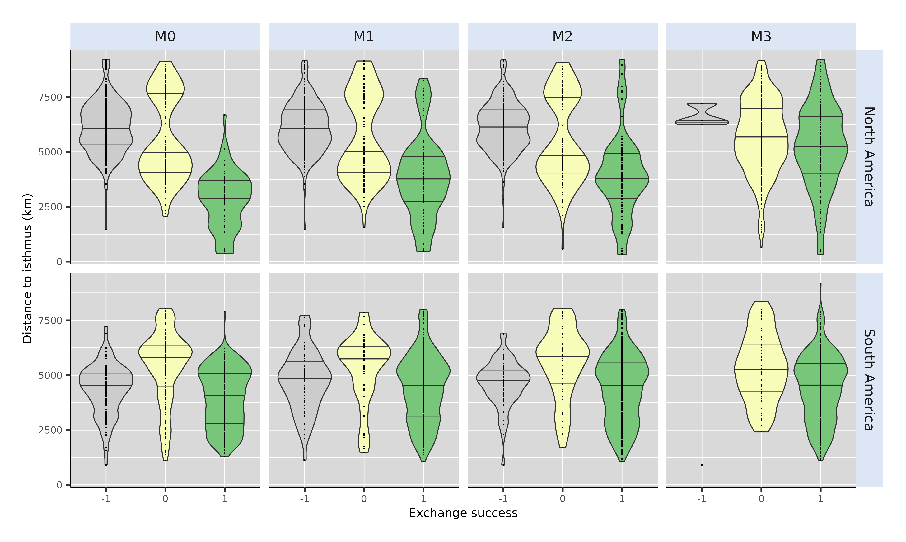
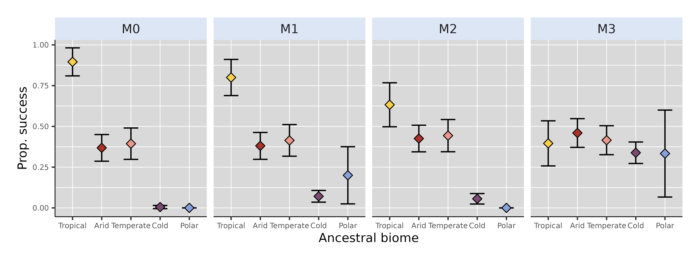
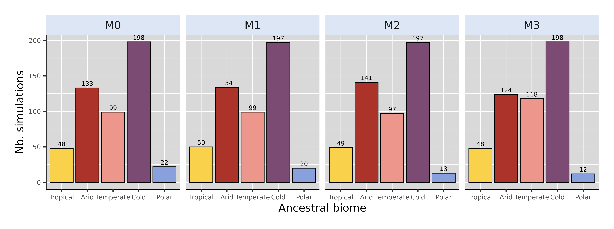
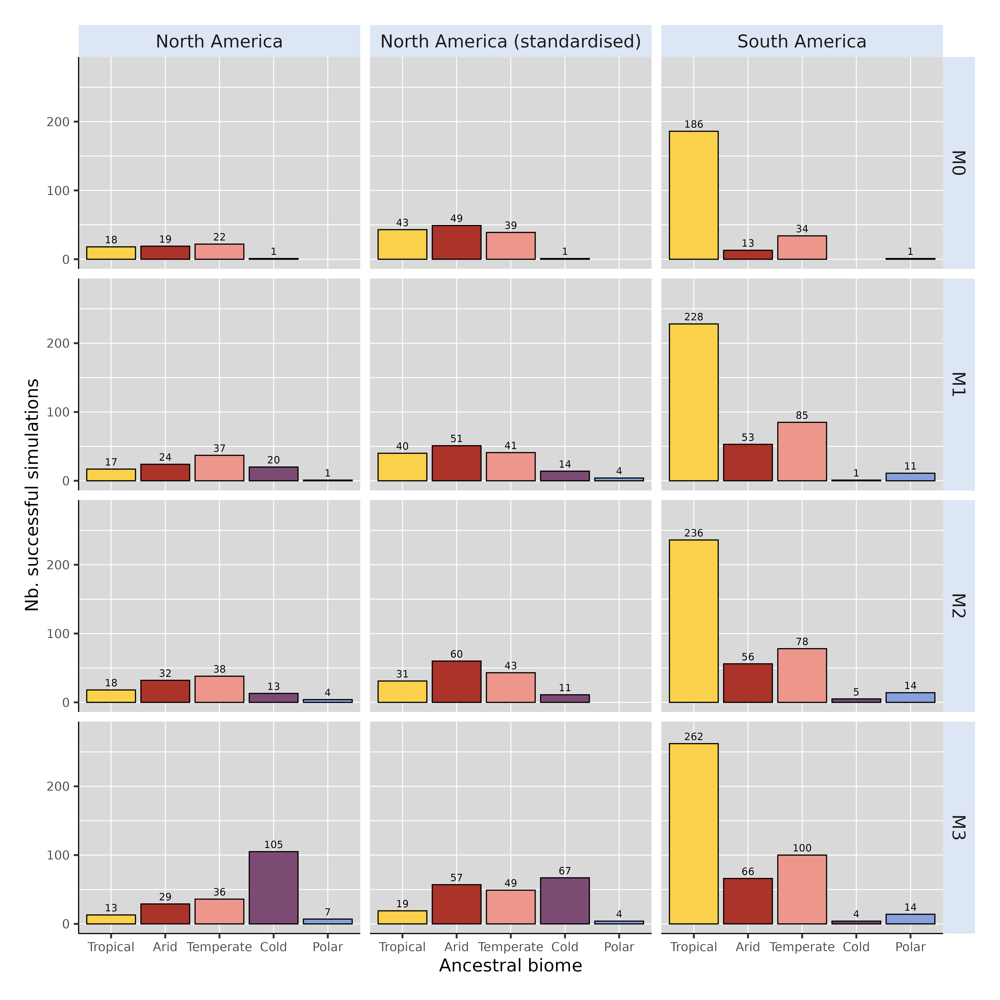

Affiliations:

¹ Institut des Sciences de l’Evolution de Montpellier, Université de Montpellier, CNRS, IRD, Place Eugène Bataillon, 34095 Montpellier cedex 5, France.

² Centro de Investigación Mariña, Departamento de Ecoloxía e Bioloxía Animal, Universidade de Vigo, Campus Lagoas-Marcosende, 36310 Vigo, Spain

\newpage

# STAR METHODS

## KEY RESOURCES TABLE

| **REAGENTS OR RESOURCE** | **SOURCE** | **IDENTIFIER** |
|----------------------|----------------|----------------------------------|
| **Deposited data** |  |  |
| Biodiversity simulations | This study | *Link to be produced* |
| **Software and algortithms** |  |  |
| R scripts for all the analyses | This study | <https://github.com/Buffan3369/GABI-gen3sis.git> |
| R package gen3sis V 1.5.11 | Hagen et al. @hagen2021 | <https://github.com/project-gen3sis/R-package> |
| R package tidyverse V 2.0.0 | Wickham et al. @wickham2019 | <https://CRAN.R-project.org/package=tidyverse> |
| R package raster V 3.6.31 | Hijmans et al. @hijmans2025 | <https://CRAN.R-project.org/package=raster> |
| R package terra V 1.8-15 | Hijmans et al. @hijmans_terra_2025 | <https://CRAN.R-project.org/package=terra> |
| R package spaths V 1.2.0 | Düben et al. @duben_spaths_2025 | <https://CRAN.R-project.org/package=spaths> |
| R package randtoolbox V 2.0.5 | Dutang et al. @dutang_randtoolbox_2024 | <https://CRAN.R-project.org/package=randtoolbox> |

## METHOD DETAILS {#sec-methods}

Beforehand, it has to be noticed that, across the entire study, "North America" actually refers to the current North and Central American continents. The delimitation between North and South America was arbitrarily set as a straight line connecting two points located along the eastern and western coasts of present Panama ($-82.882°$lon, $7.138°$lat and $-81.369°$lon and $9.008°$lat) (see main text, Figure 1).

### Palaeoclimate data

We used the spatio-temporal terrestrial palaeoclimate series from the PALEO-PGEM atmosphere-ocean general circulation model [@holden2019], covering the last 5 Myrs with a 1 $\times$ 1 ° spatial resolution [@barreto2023]. For the scope of this work, we used two bioclimatic variables: mean annual temperature (MAT, BIO1) and mean annual precipitation (MAP, BIO12). To avoid reaching an overkillingly-high number of simulation steps, we reduced the temporal resolution of the climate simulations from a 1000-years to a 10,000-years time step.

Additionally, in order to discriminate simulations based on the biome where the initial species originates, we reclassified monthly palaeoclimate layers for our starting time ($t=5$ Myrs) according to Köppen-Geiger broad climate types [@beck2018; @galván2023]. This classification divides the world into five broad climatic regions: Polar, Cold, Temperate, Arid and Tropical, following the criteria proposed by Köppen [@köppen1900].

### Simulation model and modelling schemes

We performed spatially-explicit simulations of biodiversity using the General Engine for Eco-Evolutionary SImulationS, gen3sis, v1.5.11 [@hagen2021]. Simulations, moving forward-in-time with a 10ky time step, tracked the radiation of a clade arising from a single ancestral population, either originating in North or in South America, throughout the last 5 Myr. In gen3sis, virtual species are modelled with individual populations evolving independently, following a set of four rules: dispersal, speciation, environmental filtering and trait evolution. All simulation scenarios that we implemented only differed on the last rule (trait evolution), the first three being common to all models (or at least partly).

We elaborated a gridded landscape relying on the two time-series of the aforementioned palaeoclimatic layers. Within this landscape, populations making up virtual species inhabited a set of connected cells. At each time step, inter-cell dispersal could occur with an intensity sampled in a Weibull distribution (of shape and scale respectively termed $\phi$ and $\psi$). If, by chance, two populations happened to be disconnected, they would accumulate divergence as long as they get disconnected, at a rate ruled by a divergence factor, here set to $0.05$ (@tbl-param). Once passed a divergence threshold ($S$), speciation would occur -- note that, consequently, the only mode of speciation allowed by gen3sis is allopatry.

As our goal was to evaluate the extent to which palaeoclimate change may have shaped the unequal success of North American taxa establishing southwards compared to South American taxa establishing northwards, local climate was set as the only constraint for a population to maintain in a given cell. Each species was therefore assigned a two-dimensional climatic niche, one axis corresponding to temperature suitability and the other to precipitation suitability. The abundance of a species along an environmental gradient was ruled by two parameters -- that we also call traits -- : a population- and species-specific optimum (resp. $P_{k,l}$ and $T_{k,l}$ for the precipitation and temperature optima of the population $k$ of the species $l$) and a breadth (or tolerance) (resp. $\omega_P$ and $\omega_T$; within a simulation, breadths were shared across populations and species). A population could maintain in a given cell only if the difference between its optima and local climate (both temperature and precipitation) was below its breadths. Therefore, given a site $i$ with local precipitation and temperature at time $t$ being $P_i(t)$ and $T_i(t)$, this translates in

$$
\begin{cases}
\lvert P_i(t) - P_{k,l} \rvert < \omega_P \\
\lvert T_i(t) - T_{k,l} \rvert < \omega_T
\end{cases}
$$

Each simulation started with a single ancestral species. The range of this ancestral species was randomly selected within the desired ancestral area (*i*.*e*., North or South America). To avoid oversampling high latitudes, we merged the ancestral landscape with the centroids of an equal-area grid (\~100km spacing) generated using the R package *h3jsr* [@obrien2023]. We then sampled a centroid at random and retrieved the corresponding cell in our landscape (@fig-AllStartRange *left* and *right*). To reduce the probability of initial crash, the climate optima parameters of the ancestor were set to those of the local environment. However, due to the geometry of the two continents, this sampling scheme resulted in ancestral species starting from South America originating on average closer to the isthmus of Panama than those from North America (@fig-alldist *top*). To control for this spatial bias, we assessed the distance to the isthmus of each cell of the North American portion of our 1 $\times$ 1° landscape. We then carried out other batches of simulations starting from North America, constraining the initial distance to the isthmus of the ancestral species of the simulation $i$ to be as close as possible to same distance involving the ancestral species of the simulation $i$ starting from South America (@fig-alldist *bottom*, @fig-AllStartRange *middle*).

500 replicates were made under each modelling scheme (detailed in the next paragraph), both with North and South America as ancestral area. Across replicates, we varied 6 key parameters: (1) the divergence threshold above which speciation occurred ($S$, range = $[1, 3]$), (2) the rate of environmental niche evolution -- only in models where we allowed climatic niche to evolve ($\sigma_e$, $[0.005, 0.15]$), (3) the shape ($\phi$, $[0.5, 3]$) and (4) scale ($\psi$, $[0.1, 1]$) of the Weibull distribution acting as a dispersal kernel, (5) the strength of environmental filtering (*i*.*e*., niche breadth) for temperature ($\omega_T$, $[0.01, 0.1]$) and (6) precipitation ($\omega_P$, $[0.05, 0.3]$). As done by many authors, we ensured an even sampling of the resulting multidimensional parameter space via a quasirandom sampling technique relying on Sobol' sequences \[*e*.*g*., @hagen2021b; @skeels2023b\]. Parameter ranges were determined on the basis of a literature review, allowing to assess their biological relevance, and were further adjusted in order to limit the prevalence of crashing simulations. In addition to these varying parameters, we specified the value of several fixed parameters (@tbl-param)

We implemented various simulation scenarios where we modulated the ability of species to cope with climate change, and thus, the generalist vs. specialist nature of the simulated species. In the full-adaptationist model (*M1*, generalist), climatic optima ($P_{k,l}$ and $T_{k,l}$) were able to evolve in the direction of local climate change. To isolate the effect of a single environmental covariate on the resulting simulated biodiversity pattern, alternative versions of this model consisted of either removing the temperature (*M2*) or the precipitation (*M3*) constraint on species ecology. Besides, we also implemented a zero-adaptationist model (*M0*, specialist), where niche optima could not evolve and were therefore held constant (to their initial value) across all simulations.

Last, it is important to notice that, since the palaeoclimate reconstructions that we used ignored tectonic plate motion -- a reasonable assumption for a 5-Myr time frame -- continental position in our landscapes was held constant across simulations. Therefore, in that framework, changes in connectivity between North and South America could only arise from the environment.

## QUANTIFICATIONS AND STATISTICAL ANALYSIS

At every time step, for each run of each simulation, we used a function released by Skeels et al. @skeels2023b to save presence-absence matrices. Given a time $t$, those matrices stored on their columns the presence of each simulated species that have existed from the onset of the simulation to $t$ within each cell of the landscape (rows of the matrix) as a binary variable -- $1$: the species inhabits that cell, $0$: it does not.

Given a batch of simulations, after discarding those that crashed -- *i*.*e*., that lead to no living representative -- we quantified four metrics reflecting the occurrence, magnitude and efficiency of an eventual transcontinental exchange based on the presence-absence matrix of the last time step of each successful run (hereafter called $t_{end}$). First, we assessed the exchange success, a binary variable set to one if at least one pixel of the area to colonise (hereafter called $\mathcal{A}_{col}$, *e*.*g*., South America if the simulation started in North America) recorded a presence. Then, we recorded the biome in which the initial ancestor occurs (*i*.*e*., Tropical, Arid, Temperate, Cold, Polar) as well as the distance of this initial ancestor to a point arbitrarily located on the zone of the isthmus of Panama, ($-84°$lon, $10°$lat). Last, in the case of a successful exchange, we quantified the number of virtual taxa recorded in $\mathcal{A}_{col}$ at $t_{end}$ -- referred to as "colonised $\alpha$-diversity" -- and the proportion of $\mathcal{A}_{col}$ actually colonised at $t_{end}$ as the ratio between the number of cells occupied by the colonisers and the total number of available cells (*i*.*e*., surface of $\mathcal{A}_{col}$).

\newpage

# Supplementary figures

All across the study, metrics computed out of simulations starting from North America are shown in coral red, and those starting from South America in cyan.

```{r, echo=FALSE}
#| label: fig-alldist
#| out-height: 8cm
#| out-width: 17cm
#| fig-cap: Initial distances to the isthmus of all simulations ($n=500$), either starting from North or South America. On the top row, locations of simlation's ancestral species resulted from a random landmass-scale equal-area sampling scheme, both starting from North and South America. On the bottom row, initial distances to the isthmus of simulations originating in North America were standardised to those of South America (see @sec-methods). Note that no change was made for simulations starting from South America.
 


```

```{r, echo=FALSE}
#| label: fig-propsuccess-std
#| out-height: 8cm
#| out-width: 16cm
#| fig-cap: Proportion of simulations leading to a successful exchange to the other continent after standardising initial distances to the isthmus of simulated species originating in North America to those of simulated species from South America (see @sec-methods). This proportion is computed as the ratio, given an initial continent and a modelling scenario, between the number of simulations leading to a transcontinental exchange and the total number of simulations resulting in at least one living species at the final state -- *i*.*e*., excluding crashes, see @tbl-crash. From left to right are depicted the outcome of the zero-adaptationist model ($M0$, species climatic niche does not change through time -- climate specialists), full adaptationist model ($M1$, species climatic niche evolves following local changes in temperature and precipitations -- climate generalists) and alternative versions of $M1$ where species ecological niche is only determined by precipitation ($M2$) or temperature ($M3$). Dots represent mean success proportion estimates and error bars show their associated Binomial-derived 95% confidence interval.



```

```{r, echo=FALSE}
#| label: fig-metrics-std
#| out-height: 15cm
#| out-width: 21cm
#| fig-cap: A few metrics summarising climate-mediated interchange after standardising initial distances to the isthmus of simulations starting from North America to those starting from South America. Each individual plot shows the outcome of simulations starting in North (red) and South (cyan) America. (*top*) Proportion of foreign continent's colonised area. (*middle*) Diversity within the colonised area. (*bottom*) Distance to the isthmus. The first two metrics have been computed out of successful simulations, *i*.*e*., that resulted in a transcontinental faunal exchange.
 


```

```{r, echo=FALSE}
#| label: fig-AllStartRange
#| out-height: 22cm
#| out-width: 17cm
#| fig-cap: Starting range of all simulations either starting from North America (*left*), North America after standardising initial distances to the isthmus with those from South America (*middle*) or South America (*right*).


```

```{r, echo=FALSE}
#| label: fig-SuccessStartRange
#| out-height: 22cm
#| out-width: 17cm
#| fig-cap: Starting range of successful simulations generated under each model (from $M0$ to $M3$), either starting from North America (*left*), North America after standardising initial distances to the isthmus with those from South America (*middle*) or South America (*right*).


```

```{r, echo=FALSE}
#| label: fig-InitDist
#| out-height: 8cm
#| out-width: 16cm
#| fig-cap: Comparison of the initial distance to the isthmus between successful and unsuccessful simulations of each of our four models, either starting from North (top) or South (bottom) America. Successful simulations ($Exchange$ $Sucess=1$) are displayed in green, whereas unsuccessful simulations ($Exchange$ $Sucess=0$) are displayed in yellow. Dashed lines on top and bottom of the distribution represent the 25% and 75% quantiles whereas the thicker full line in the middle shows the median (50% quantile).


```

```{r, echo=FALSE}
#| label: fig-InitDistCrash
#| out-height: 8cm
#| out-width: 16cm
#| fig-cap: Comparison of the initial distance to the isthmus between successful and unsuccessful simulations of each of our four models including simulations that crashed (*i*.*e*., resulted in no living representative at the final time step), either starting from North (top) or South (bottom) America.  Successful simulations ($Exchange$ $Sucess=1$) are displayed in green, unsuccessful simulations ($Exchange$ $Sucess=0$) in yellow and simulation that crashed ($Exchange$ $Sucess=-1$) in grey. Dashed lines on top and bottom of the distribution represent the 25% and 75% quantiles whereas the thicker full line in the middle shows the median (50% quantile).


```

```{r, echo=FALSE}
#| label: fig-ExchBiomeProp
#| out-height: 8cm
#| out-width: 17.5cm
#| fig-cap: Proportion of successful simulations starting from North America -- after standardising initial distances to the isthmus with simulations starting from South America (see @sec-methods and @fig-alldist) -- for each scenario. Coloured dots and error bars respectively show proportion estimates -- ratio between number of successful simulations and total number of simulations starting for a given biome -- and their associated Binomial-derived 95% confidence intervals.


```

| 
| 

```{r, echo=FALSE}
#| label: fig-StdBiomeCount
#| out-height: 8cm
#| out-width: 17.5cm
#| fig-cap: Biome where the ancestral species of each of the 500 simulation originated, for each modelling scenario, starting from North America after standardising initial distance to isthmus with that of simulations starting from South America (see @sec-methods and @fig-alldist). We removed simulations starting from a cell that could not be assigned a biome from our counts, hence the reason why some are not exactly summing to 500.


```



```{r, echo=FALSE}
#| label: fig-ExchBiomeCount
#| out-height: 17cm
#| out-width: 23cm
#| fig-cap: Biome where the ancestral species of each simulation leading to a successful exchange originated, for each continent and each scenario.  "North America standardised" refers to simulations starting from North America after standardising initial distance to isthmus with that of simulations starting from South America (see @sec-methods and @fig-alldist).


```



# Supplementary tables

```{r, echo=FALSE}
library(kableExtra)
```

```{r, echo=FALSE}
#| label: tbl-param
#| tbl-cap: Fixed parameter values for gen3sis simulations.
 
names <- c("`divergence_factor`", "`max_species`", "`max_coex_species`", "`start_species`", "`init_ab`", "`grid_cell_distance`")
values <- c(0.05, 10000, 1000, 1, 500, 111)
descr <- c("How much divergence disconnected populations accumulate across iterations",
           "Maximum number of simulated species a simulation can handle (if falls above, the simulation crashes)",
           "Cell carrying capacity",
           "Number of species to start with",
           "Initial abundance of the start species",
           "Distance (in km) between two grid cells of the landscape at the equator"
           )

fixed_params <- data.frame(Name = names, 
                           Value = values,
                           Description = descr)

# Display
knitr::kable(fixed_params, align = 'c')
```

| 
| 

```{r, echo=FALSE}
#| label: tbl-crash
#| tbl-cap: Proportion of simulations that crashed -- *i*.*e*., leading to no living representative at the end of the simulation -- for each modelling scenario ($M0-3$) depending on the ancestral area (`Start` column). "North America Standardised" refers to simulations carried out from a North American ancestor after standardising initial distances to Isthmus with simulations starting from South America (see @sec-methods)

prop_crash_unstd <- readRDS("../Results/Exchanged_metrics/Crash_counter.RDS")

knitr::kable(prop_crash_unstd, align = "c")
```



# Supplementary references

::: {#refs}
:::
