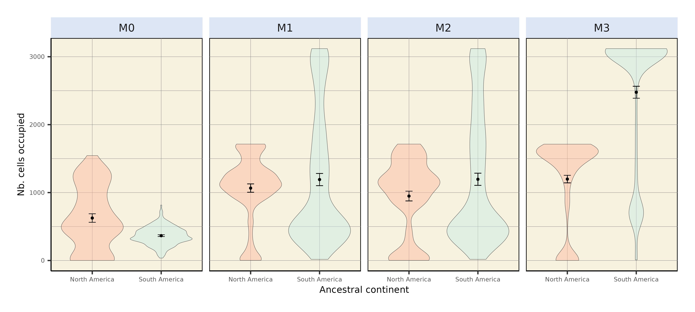
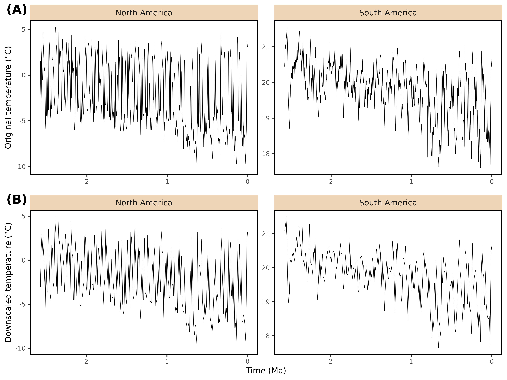

¹ Institut des Sciences de l’Evolution de Montpellier, Université de Montpellier, CNRS, IRD, Place Eugène Bataillon, 34095 Montpellier cedex 5, France

² Environment, Earth and Ecosystem Sciences, The Open University, Walton Hall, Milton Keynes, MK7 6AA, UK

³ Centro de Investigación Mariña, Departamento de Ecoloxía e Bioloxía Animal, Universidade de Vigo, Campus Lagoas-Marcosende, 36310 Vigo, Spain

# Supplementary text

## Details regarding the palaeoclimate dataset used in this study

The PALEO-PGEM series [@barreto2023] relies on the runs of Atmosphere-Ocean General Circulation Model (GCM) PLASIM-GENIE [@holden2016] temporally interpolated between each other across the last 5 million years with a 1000-year interval by the statistical emulator PALEO-PGEM [@holden2019]. The PALEO-PGEM emulator also involves a spatial downscaling step, improving the spatial resolution of the runs from PLASIM-GENIE to a $1 \times 1$° resolution, by interpolating climate anomalies onto fine-resolution climate data. The underlying philosophy of PALEO-PGEM is firstly that complex non-linear Earth system model feedbacks to external forcings can be described by decomposing those responses into a collection of orthogonal patterns (principal components), and secondly that the relative magnitudes of those patterns can be estimated as scalar functions of the forcing [@holden2010] . The approach was motivated by the widely used method of pattern-scaling [@mitchell1999], but instead of approximating the response by a single pattern, it extends this idea by combining many patterns together, therefore allowing the capture of non-linear responses. Different patterns might, for instance, arise from the effects of changing CO$_2$ concentration, or changing orbit, or of interactions between those changes. In PALEO-PGEM, ten principal components were included for each emulated variable, sufficient to explain 99% of the variance of simulated temperature and 90% of the variance of simulated precipitation [@holden2019].

In detail, PALEO-PGEM applies Gaussian process emulation of the singular value decomposition of ensembles of runs from the intermediate complexity fully 3D atmosphere– ocean coupled model PLASIM-GENIE [@holden2016]. The emulator was built from two 50-member quasi-equilibrium simulation ensembles, one of which varied orbital forcing and CO$_2$ , while the other repeated this ensemble with the addition of a varying ice sheet, so that the effect of ice sheets was treated as a (non-linear) anomaly that was combined with the response to other forcings. Spatial fields of monthly temperature and precipitation were emulated at 1000-year intervals, driven by time series of scalar boundary-condition forcing of CO$_2$ concentration [@lüthi2008], the three orbital parameters [@berger1991] and ice volume [@stap2017]. The native resolution climate data (\~5° × 5°) was downscaled to a spatial resolution of 1°×1° [@barreto2023] using anomaly adjustments from the climate baseline of CHELSA [@karger2017].

## Details regarding simulation initialsiation

Each individual simulation started with a single ancestral species. The range of this ancestral species was randomly selected within the desired ancestral area (*i*.*e*., North or South America). To avoid oversampling high latitudes, we merged the ancestral landscape with the centroids of an equal-area grid (\~100km spacing) generated using the R package *h3jsr* [@obrien2023]. We then sampled a centroid at random and retrieved the corresponding cell in our landscape (@fig-AllStartRange *left* and *right*). The climate optima parameters of the ancestor were set to those of the local environment. However, due to the geometry of the two continents, this sampling scheme resulted in ancestral species starting from South America originating on average closer to the isthmus of Panama than those from North America (@fig-alldist *top*). To control for this spatial bias, we assessed the distance to the isthmus of each cell of the North American portion of our 1 $\times$ 1° landscape. We then carried out other batches of simulations starting from North America, constraining the initial distance to the isthmus of the ancestral species of the simulation $i$ to be as close as possible to the same distance involving the ancestral species of the simulation $i$ starting from South America (@fig-alldist *bottom*, @fig-AllStartRange *middle*).

## Details regarding parameter values in our simulation framework

Across the 500-member ensembles, we varied 6 key parameters: (1) the divergence threshold above which speciation occurred ($S$, range = $[1, 3]$), (2) the rate of environmental niche evolution -- only in models in which we allowed climatic niche to evolve ($\sigma_e$, $[0.005, 0.15]$), (3) the shape ($\phi$, $[0.5, 3]$) and (4) scale ($\psi$, $[0.1, 1]$) of the Weibull distribution acting as a dispersal kernel, (5) the strength of environmental filtering (*i*.*e*., niche breadth) for temperature ($\omega_T$, $[0.01, 0.1]$) and (6) precipitation ($\omega_P$, $[0.05, 0.3]$). To explore the sensitivity of the simulated pattern to temperature breadth, three different ranges of $\omega_T$ were tested: $[0.01, 0.1]$, $[0.01, 0.6]$ and $[0.01, 1]$. As done by many authors, we ensured an even sampling of the resulting multidimensional parameter space via a quasirandom sampling technique relying on Sobol' sequences [*e*.*g*., @hagen2021b; @skeels2023b]. Parameter ranges were determined on the basis of a literature review, ensuring their biological relevance. These ranges were further adjusted to limit the prevalence of crashing simulations. In addition to these varying parameters, we specified the value of several fixed parameters (Table S1). Identical parameter values were used in each of the eight 500-member ensembles.

## Geographic contingency and the Great American Biotic Interchange

Our findings leave room for possible random effects related to geography. Indeed, irrespective of the initial landmass, successful simulations originated on average closer to the isthmus of Panama than unsuccessful ones (Figures S6--7). This suggests that some simulations were unsuccessful not only due to climatic filters, but also because they simply started too far from the landbridge, preventing them from reaching it during the simulation. The relationship between a taxon’s success in reaching the other continent and the distance between its geographic range and the isthmus of Panama has long been postulated in the literature [*e*.*g*., @simpson1980]. @webb1991 illustrated this view with the example of antilocaprids, which "were probably capable of living somewhere in the Andes, \[but\] were simply too far from the isthmian link to make the exodus". Following this line, a recent study characterised a negative correlation between the proportion of migrant taxa within fossil assemblages of either North or South America and the distance of the fossil assemblage to the Panamanian landbridge [@motta2025]. Therefore, geographic contingency must also have played a significant role in the asymmetry of the GABI.

## Limitations and perspectives

Our work comprises a wealth of limitations. Below, we discuss some of them and propose possible avenues for future improvements.

Differences in the pace at which migrant and native lineages diversified have long been proposed to play a significant role in the asymmetry of the GABI. By reconstructing raw macroevolutionary dynamics from the fossil record, @marshall1982 highlighted that northern immigrant genera experienced notoriously higher origination and lower extinction rates than native lineages in South America. More recently, using a Bayesian framework accounting for preservation heterogeneities to infer fossil-based macroevolutionary trends, @carrillo2020 showed that, in their home continent, native South American lineages experienced higher extinction rates than migrant lineages. In our simulations, for a species to go extinct, it needs to disappear from each cell across the landscape. As environmental filtering -- in our case, the only force driving diversification -- acts at the scale of a pixel, species extinction is therefore very rare. As a result, our framework did not allow us to relate the simulated environment-dependent inter-American faunal exchange with any diversification process. Realistic modelling of macroevolutionary processes is therefore an avenue towards improvements among mechanistic eco-evolutionary simulators, particularly in the framework of the GABI.

Also, we evidenced a nuance between the proportion of colonised area and the absolute colonised area (*Main text*, Figure 3 and @fig-AbsColArea) simply comes from the imbalanced number of pixels between the two landmasses, being around two times larger for North America than for South America (@fig-framework). A possible avenue to avoid such confusions when carrying eco-evolutionary simulations at such a broad spatial scale (here from *ca*. 80° N to *ca*. 40° S lat) would be to use equal-area landscapes. In our case, this would require conversions in the palaeoclimate simulations that we use, as well as adapting dispersal probabilities based on actual distances rather than equal-degree pixels.

In addition, the results presented over this study are biased by the use of a single palaeoclimatic reconstruction. @holden2019 include a discussion section on the main issues for PALEO-PGEM, considering the limitations of low-resolution and intermediate-complexity climate models, the use of limited climate forcing, the assumption of a fixed relationship between global sea-level reconstructions and the spatial configuration of ice sheets, and limitations of anomaly-based spatial downscaling. Ideally, given these uncertainties, the robustness of the results from the application of this -- or indeed any -- climate model should be tested, for instance by using an alternative climate reconstruction. However, to our knowledge, PALEO-PGEM-Series is the only palaeoclimate dataset that has both sub-orbital temporal resolution and extends back to 5 Ma, as needed for our study. One alternative dataset that comes close to our needs is the 3 Ma transient coupled simulation with CESM1.2 [@yun2023], made tractable by splicing together 42 simulations that were run in parallel. Unfortunately, this does not encompass the Pliocene and would thus only allow to test for biotic exchange occurring during the Quaternary, narrowing the scope of the present paper. In contrast, the Oscillayers dataset [@gamisch2019] does extend back to 5.4 Ma, but the approach of pattern scaling LGM anomalies does not represent orbital variability -- the dominant driver of climate variability at 10 ka. Furthermore, it unrealistically assumes that Pliocene warming has the same spatial pattern as LGM cooling. Similar concerns were expressed by @brown2020. Although Oscillayers superficially meets our requirements, this dataset is not fit for our purpose, and in our view should not be used in the Pliocene for any application. Consequently, at time of writing, the sensitivity of our pipeline to the palaeoclimate reconstruction used cannot be evaluated, which represents a strong limitation to our work.

The main message of our study is that climate alone is not sufficient to explain the asymmetry of the GABI. Thus, other factors unaccounted here might have been at play to shape the uneven faunal exchange that occurred across the Americas during the GABI. Among them, one can think about biotic interactions. Convinced that the overwhelming success of North American mammals in South America could "*not be pure coincidence*", @simpson1950 proposed the asymmetry of the GABI to stem from the different levels of exposure to competition between the North and South American faunas. Throughout the Cenozoic, exposure to competition had indeed been much larger for North than South American mammal taxa, due to the isolated charcter of South America, contrasting with the several connections of North America with other continents (*e*.*g*., Eurasia). In addition, some studies proposed the asymmetry of the GABI to result from prey-predator interactions, with Northern lineages preying on Southern ones [*e*.*g*., @faurby2016]. However, several process-based analyses of the fossil record provided no evidence for biotic interactions involving native South American mammals and their northern counterparts [*e*.*g*., @prevosti2013; @tarquini2022]. Hence, incorporating biotic compounds in mechanistic frameworks such as the one we have implemented here would be a worthy avenue for future studies tackling the asymmetry behind the GABI.

Last, the landscape designed for the purpose of this study (@fig-framework) only permitted transcontinental faunal exchange via the isthmus of Panama, the closure of which being assumed to be the main trigger of the GABI [@marshall1982]. Yet, the fossil record of the Caribbean Islands has provided evidence for faunal supply both from the South and the North American landmasses, in particular since the late Miocene [*e*.*g*., @morgan1993; @macphee2011]. Although over-water dispersal has long been regarded as the prevailing mechanism [@morgan1993], recent geological advances have provided evidence for (1) the emergence of land bridges connecting South America to Caribbean Islands and (2) the formation of mega-islands -- during Pleistocene glacial maximum episodes -- several times since the Mio-Pliocene boundary @cornée2021. Hence, it would make sense to consider the Caribbean Islands as an alternative dispersal pathway between the Americas, as shown to be the case in earlier time frames, for instance, near the Eocene--Oligocene boundary (*i*.*e*., GAARlandia hypothesis) [@cornée2021; @marivaux2020b]. However, due to the idiosyncratic eco-evolutionary processes shaping insular systems [*e*.*g*., @warren2015] as well as the poor mention of the Caribbean Islands as a stepping-stone in the literature of the GABI, we believe that considering this alternative route in our framework would rather deserve to be the topic of another study.



# Supplementary figures

All across the study, metrics computed out of simulations starting from North America are shown in coral red, and those starting from South America in cyan.

```{r, echo=FALSE}
library(knitr)
```

```{r, echo=FALSE}
#| label: fig-framework
#| out-height: 11cm
#| out-width: 11cm
#| fig-cap: Average palaeoclimate histories within our studied landmasses. North America is displayed in coral red and South America in cyan. Spatially-averaged climate variables (Annual Temperature and Precipitation) are taken from the PALEO-PGEM series @barreto2023. This series being spatialised at a 1 x 1° resolution, numbers inside the continents represent the quantity of overlaying pixels from the climate grid within each continent. On climate plots, the time frame of the onset of significant land mammal exchange across the americas [@bacon2016; @woodburne2010] is indicated by the light purple vertical bands. The empirically-derived asymmetry of the transcontinental land mammal exchange is represented by the thickness of the two arrows, the thicker the arrow, the more intense the exchange.

include_graphics("../Figures/MS/Main/Figure_framework/Figure_framework.png")
```

```{r, echo=FALSE}
#| label: fig-alldist
#| out-height: 8cm
#| out-width: 17cm
#| fig-cap: Initial distances to the isthmus of all simulations ($n=500$), either starting from North or South America. On the top row, locations of simlation's ancestral species resulted from a random landmass-scale equal-area sampling scheme, both starting from North and South America. On the bottom row, initial distances to the isthmus of simulations originating in North America were standardised to those of South America (see *Methods*). Note that no change was made for simulations starting from South America.
 
include_graphics("../Figures/MS/Supp/metrics_std/panel_all_starting_distances.png")

```

```{r, echo=FALSE}
#| label: fig-propsuccess-std
#| out-height: 8cm
#| out-width: 16cm
#| fig-cap: Proportion of simulations leading to a successful exchange to the other continent after standardising initial distances to the isthmus of simulated species originating in North America to those of simulated species from South America (see *Methods*). This proportion is computed as the ratio, given an initial continent and a modelling scenario, between the number of simulations leading to a transcontinental exchange and the total number of simulations resulting in at least one living species at the final state -- *i*.*e*., excluding crashes, see @tbl-crashw0.1. From left to right are depicted the outcome of the fixed-niche model ($M0$, species climatic niche does not change through time), adaptive-niche model ($M1$, species climatic niche evolves following local changes in temperature and precipitations) and alternative versions of $M1$ where species ecological niche is only determined by precipitation ($M2$) or temperature ($M3$). Dots represent mean success proportion estimates and error bars show their associated Binomial-derived 95% confidence interval.


include_graphics("../Figures/MS/Supp/metrics_std/prop_successful_col_STD.png")
```

```{r, echo=FALSE}
#| label: fig-metrics-std
#| out-height: 15cm
#| out-width: 21cm
#| fig-cap: A few metrics summarising climate-mediated interchange after standardising initial distances to the isthmus of simulations starting from North America to those starting from South America. Each individual plot shows the outcome of simulations starting in North (red) and South (cyan) America. (*top*) Proportion of foreign continent's colonised area. (*middle*) Diversity within the colonised area. (*bottom*) Distance to the isthmus. The first two metrics have been computed out of successful simulations, *i*.*e*., that resulted in a transcontinental faunal exchange.
 
include_graphics("../Figures/MS/Supp/metrics_std/panel_area_div_dist_std.png")

```

```{r, echo=FALSE}
#| label: fig-AllStartRange
#| out-height: 22cm
#| out-width: 17cm
#| fig-cap: Starting range of all simulations either starting from North America (*left*), North America after standardising initial distances to the isthmus with those from South America (*middle*) or South America (*right*).

include_graphics("../Figures/MS/Supp/starting_ranges/Initial_ranges_All_runs.png")
```

```{r, echo=FALSE}
#| label: fig-SuccessStartRange
#| out-height: 22cm
#| out-width: 17cm
#| fig-cap: Starting range of successful simulations generated under each model (from $M0$ to $M3$), either starting from North America (*left*), North America after standardising initial distances to the isthmus with those from South America (*middle*) or South America (*right*).

include_graphics("../Figures/MS/Supp/starting_ranges/Initial_ranges_successful_runs.png")
```

```{r, echo=FALSE}
#| label: fig-InitDist
#| out-height: 8cm
#| out-width: 16cm
#| fig-cap: Comparison of the initial distance to the isthmus between successful and unsuccessful simulations of each of our four models, either starting from North (top) or South (bottom) America. Successful simulations ($Exchange$ $Sucess=1$) are displayed in green, whereas unsuccessful simulations ($Exchange$ $Sucess=0$) are displayed in yellow. Dashed lines on top and bottom of the distribution represent the 25% and 75% quantiles whereas the thicker full line in the middle shows the median (50% quantile).

include_graphics("../Figures/dist_to_isthm/distance_violin_panel_NoCRASH.png")
```

```{r, echo=FALSE}
#| label: fig-InitDistCrash
#| out-height: 8cm
#| out-width: 16cm
#| fig-cap: Comparison of the initial distance to the isthmus between successful and unsuccessful simulations of each of our four models including simulations that crashed (*i*.*e*., resulted in no living representative at the final time step), either starting from North (top) or South (bottom) America.  Successful simulations ($Exchange$ $Sucess=1$) are displayed in green, unsuccessful simulations ($Exchange$ $Sucess=0$) in yellow and simulation that crashed ($Exchange$ $Sucess=-1$) in grey. Dashed lines on top and bottom of the distribution represent the 25% and 75% quantiles whereas the thicker full line in the middle shows the median (50% quantile).

include_graphics("../Figures/dist_to_isthm/distance_violin_panel_CRASH.png")
```

```{r, echo=FALSE}
#| label: fig-ExchBiomeProp
#| out-height: 8cm
#| out-width: 17.5cm
#| fig-cap: Proportion of successful simulations starting from North America -- after standardising initial distances to the isthmus with simulations starting from South America (see *Methods* and Figure S2) -- for each scenario. Coloured dots and error bars respectively show proportion estimates -- ratio between number of successful simulations and total number of simulations starting for a given biome -- and their associated Binomial-derived 95% confidence intervals.

include_graphics("../Figures/MS/Supp/biomes/starting_biome_EXCH_PROP_STD.png")
```

| 
| 

```{r, echo=FALSE}
#| label: fig-StdBiomeCount
#| out-height: 8cm
#| out-width: 17.5cm
#| fig-cap: Biome where the ancestral species of each of the 500 simulation originated, for each modelling scenario, starting from North America after standardising initial distance to isthmus with that of simulations starting from South America (see *Methods* and Figure S2). We removed simulations starting from a cell that could not be assigned a biome from our counts, hence the reason why some are not exactly summing to 500.

include_graphics("../Figures/MS/Supp/biomes/starting_biome_STD.png")
```



```{r, echo=FALSE}
#| label: fig-AbsColArea
#| out-height: 8cm
#| out-width: 17.5cm
#| fig-cap: Absolute colonised area, expressed as the number of foreign continent's occupied cells for each successful simulation generated under each model ($M0$--$M3$).


```

```{r, echo=FALSE}
#| label: fig-TempDownscaled
#| out-height: 7.5cm
#| out-width: 10cm
#| fig-cap: Effect of climatic variable temporal upscaling. Continent-averaged temperature estimates were produced for both North and South America, with the original time step of the climate emulator (1 ky, **A**) or after downscaling to a 10 ky time step (**B**).


```

```{r, echo=FALSE}
#| label: fig-ClimSnapshots
#| out-height: 9cm
#| out-width: 19cm
#| fig-cap: Snapshots of the two bioclimatic variables used in this study (Annual Temperature and precipitations, respectively called Bio1 and Bio12 in the climate model) from the PALEO-PGEM series [@barreto2023], together with the corresponding biome reconstructions that we carried out following @galván2023 (using broad climate classes), at key time steps. Last Interglacial corresponds to t=120ka and Last Glacial Maximum to t=21ka. In the bottom row, the "Tropical" class was subdivided into "Tropical forest", incorporating closed Rainforest and Moist forest (Monsoon), and "Tropical savannah", associated with a more open landscape. Last Interglacial corresponds to t=120ka and Last Glacial Maximum to t=21ka.

include_graphics("../Figures/MS/Supp/Clim_snapshots/Climatic_snapshots_panel_PALEO-PGEM_biomes_savannah.pdf")

```

```{r, echo=FALSE}
#| label: fig-ExpandPPGEM
#| out-height: 12cm
#| out-width: 18cm
#| fig-cap: Comparative proportion of successful simulations (**A**) and of simulations that crashed (*i*.*e*., leading to no living representative at the end of the simulation) (**B**). Simulations were generated in a landscape based on the PALEO-PGEM series, either under the fixed-niche ($M0$) or the (full) adaptative-niche ($M1$) models. `w_max` indicates the upper bound of the thermal breadth parameter ($\omega_T$) associated to the corresponding batch of simulations.

include_graphics("../Figures/MS/Supp/niche_expanded/NA_vs_SA-PPGEM-diff_w.pdf")

```



# Supplementary tables

```{r, echo=FALSE}
library(kableExtra)
```

```{r, echo=FALSE}
#| label: tbl-param
#| tbl-cap: Fixed parameter values for gen3sis simulations.
 
names <- c("`divergence_factor`", "`max_species`", "`max_coex_species`", "`start_species`", "`init_ab`", "`grid_cell_distance`")
values <- c(0.05, 10000, 1000, 1, 500, 111)
descr <- c("How much divergence disconnected populations accumulate across iterations",
           "Maximum number of simulated species a simulation can handle (if falls above, the simulation crashes)",
           "Cell carrying capacity",
           "Number of species to start with",
           "Initial abundance of the start species",
           "Distance (in km) between two grid cells of the landscape at the equator"
           )

fixed_params <- data.frame(Name = names, 
                           Value = values,
                           Description = descr)

# Display
kable(fixed_params, align = 'c')
```

| 
| 

```{r, echo=FALSE}
#| label: tbl-crashw0.1
#| tbl-cap: Proportion of simulations that crashed -- *i*.*e*., leading to no living representative at the end of the simulation -- for each modelling scenario ($M0-3$) depending on the ancestral area (`Start` column). "North America Standardised" refers to simulations carried out from a North American ancestor after standardising initial distances to Isthmus with simulations starting from South America (see *Methods*). Simulations were obtained with a narrow temperature niche ($\omega_T \in [0.01, 0.1]$).

prop_crash_unstd <- readRDS("../Results/Exchanged_metrics/Crash_counter.RDS")

kable(prop_crash_unstd, align = "c")
```

| 
| 

```{r, echo=FALSE}
#| label: tbl-crash_diffw
#| tbl-cap: Proportion of simulations that crashed depending on the ancestral area when varying thermal niche breadth, with the upper bound of the thermal breadth range (`w_max` column) ranging from 0.1, 0.6 to 1.

prop_crash <- readRDS("../Results/Exchanged_metrics/Crash_counter_diff_w.RDS")
colnames(prop_crash) <- c("Start", "w_max", "Model", "Proportion")

kable(prop_crash, align = "c")
```



```{r, echo=FALSE}
#| label: tbl-RefSilhouettes
#| tbl-cap: References for the silhouettes used in Figure 1, from Phylopic.

library(readxl)
tbl <- read_xlsx("./phylopic_ID_table.xlsx")
# Italicise species names
tbl$Silhouette <- sapply(X = tbl$Silhouette, FUN = function(x){paste0("*", x, "*")})
# Header in bold
colnames(tbl) <- sapply(X = colnames(tbl), FUN = function(x){paste0("**", x, "**")})

# Display
kable(tbl, align = "c")
```



# Supplementary references

::: {#refs}
:::
