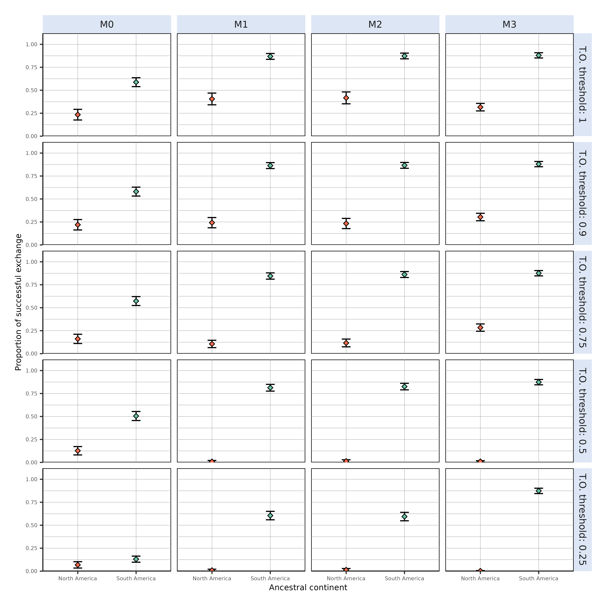
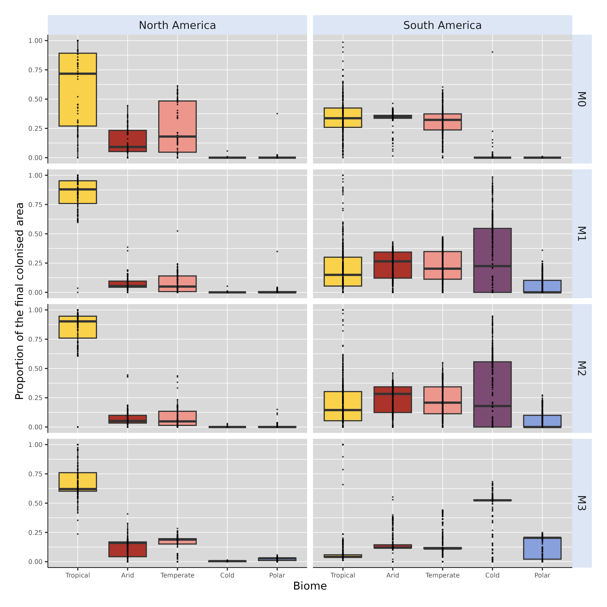

```{r, echo=FALSE}
#| label: fig-ExchBiomeCount
#| out-height: 17cm
#| out-width: 23cm
#| fig-cap: Biome where the ancestral species of each simulation leading to a successful exchange originated, for each continent and each scenario.  "North America standardised" refers to simulations starting from North America after standardising initial distance to isthmus with that of simulations starting from South America (see *Material and Methods* and Figure S2).

knitr::include_graphics("../../Figures/MS/Supp/biomes/starting_biome_EXCH.png")
```

```{r, echo=FALSE}
#| label: fig-TNC_thr
#| out-height: 17cm
#| out-width: 23cm
#| fig-cap: Proportion of successful exchanges after removing runs with different levels of tropical occupancy (T.O.) within the colonised continent, for each initial landmass--modelling scenario combination. For each successful run, T.O. was quantified as the proportion of colonised area assigned to the tropical biome. Success proportions were further assessed after removing runs with proportion of colonised area above a given threshold of T.O., ranging from $25\%$ to $100\%$ of the colonised area.


```

```{r, echo=FALSE}
#| label: fig-PropFinalAreaBiome
#| out-height: 17cm
#| out-width: 23cm
#| fig-cap: Proportion of the final area occupied within each biome after each successful simulation. Rows discriminate the model that generated simulations (from $M0$ to $M3$), and columns the continent where the simualtion started (either North or South America).


```
